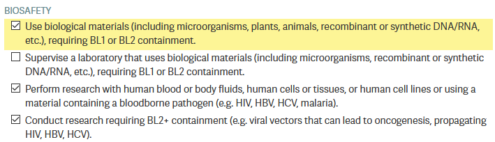

===================================
Day 0: Software and training setup
===================================

Our lab uses a lot of different software and various webservices.
Before beginning IAP, you should install at least everything required
on the list here, as well as completing all of the required EHS trainings.

EHS setup and trainings
=======================
Adding yourself to the lab's training group will register you with the
EHS system and add all necessary trainings to your profile.

1. Go to https://atlas.mit.edu and go to the learning center, through the tab
   on the left:

   .. image:: img/atlas_learning_center.png
    :alt: Learning center
    :align: center

2. In the upper right, select "My profile", then "Update PI/activities"
3. Add Kate E. Galloway as your PI.
4. Select the following training types. If you are an undergrad, do not
   select the BL2+ training group.

            performing research with human cells.

.. image:: img/atlas_chemical_training.png
    :alt: Select the 'use potentially hazardous chemicals".

.. image:: img/atlas_cryo_training.png
    :alt: Select the "working with cryogenic liquids" training.

5. After submitting, you will see many required trainings. Some have a
   required 'classroom' component, such as the *Lab Specific Chemical Hygiene
   training*, which will be completed with an in-lab walkaround.

.. note::
    One of the components of the bloodborne pathogen training
    is the opportunity to be vaccinated for Hepatitis B or to
    have an antibody titer test for free.

    Most of us were vaccinated for HepB as children, but that
    vaccine was only ~90% effective, so you may want to get
    the free antibody titer test. You can get a free booster
    or get doses of a new, more modern HepB vaccine if you
    no longer have HepB antibodies.

6. If you are going to be helping with mouse work, still under the
   'My Profile' tab, you should click **Join Another Group** under training
   groups and add the **68N: Mouse** training group.

7. Grad students and postdocs should also complete the 
   `Autoclave Safety Training <http://web.mit.edu/training/course.html?course=EHS00254w&sys=PS1>`_
   module.

.. _software: 

Software and webservices
========================

Core webservices
----------------
* Create a `Quartzy account <https://www.quartzy.com/>`_. Using your MIT email is recommended.
* Create a `Github account <https://github.com/>`_. You can use either a personal or MIT email.

  * Activate your student benefits by going to https://education.github.com/discount_requests/student_application.
    You will be asked to connect your MIT email and send in a picture of your student ID. (Because
    MIT does not remove emails for alums, they need to confirm active student status.)

* Create a `Zotero account <https://www.zotero.org/user/register>`_. Using a personal email is
  recommended for permanence reasons.
* Create an `ORCID <https://orcid.org/register>`_. Adding all of your active emails is recommended.
* (Optional) Sign up for an `MIT Google Workspace <https://ist.mit.edu/g-suite/request>`_ account. 
  This provides access to Google services like Drive, Docs, Calendar, etc. 

After creating these accounts, message the following to the ``#iap`` slack channel: your **Kerberos ID**, 
your **Github username**, your **Zotero username**, the email you used to create your **Quartzy account**, 
and the email you'd like added to the lab **Google Calendar**. We'll get you added to all of the above. 
You will have to:

* Accept the Github invitation to the `gallowaylabmit organization <https://github.com/gallowaylabmit>`_.
* Accept the Zotero invitation to the ``gallowaylab`` group,
  checking that it appears in your `group list <https://www.zotero.org/groups/>`_.

.. _OneDrive syncing:

Shared storage
--------------
We use **OneDrive** for shared lab storage. OneDrive's web interface is slightly clunky,
and occasionally you have to wait a minute for syncing to occur, but it is the MIT option
that offers us the largest amount of storage space, without having bandwidth limits (unlike MIT's Google Drive).

OneDrive also has an excellent implementation of "files-on-demand"/"online sync", where all
files in the shared storage *appear* to be accessible, but do not actually take up local
disk space until you open them/unless you manually trigger a download, at which point
the software invisibly downloads files in the background. There's no cost to having
the entire shared folder locally synced.

OneDrive also has tight integration with Office products, allowing Google Drive-esque live,
multi-person editing of Office documents saved inside it.

We share presentations, software, primers, and plasmids with each other through the shared
library, and all lab instruments will save data into OneDrive so everything is accessible.

When you see a file location like ``instruments\data\attune`` without an additional information,
it is likely a path inside the OneDrive.

After being given access:

1. If not on a recent version of Windows 10 (e.g. Win 7, MacOSX, etc), download the
   `OneDrive client <https://www.microsoft.com/en-us/microsoft-365/onedrive/download>`_.
   Recent versions of Windows come with this preinstalled.
2. Bookmark the web version here: https://mitprod.sharepoint.com/sites/GallowayLab/Shared%20Documents
3. On the web version, select the **Sync** button in the top tab:

    .. image:: img/onedrive_sync.png
        :alt: The sync button is the fourth button across.

4. This will trigger the OneDrive software you installed. It will ask you for a local folder
   to sync into. After several minutes, it will show "OneDrive is up to date", and all files
   should be accessible.

Experimental software
---------------------
* **SnapGene:** We use SnapGene for our cloning analysis. Download it through IST 
  `here <https://downloads.mit.edu/released/snapgene/vendor-registration.html>`__,
  if asked for a registration code, get it
  `here <http://downloads.mit.edu/released/snapgene/group-name_registration-code.txt>`__
  (certificates required for both links).
* **FlowJo:** We have a single license on lab computers for analyzing flow cytometry data; we can show you how it works in-lab.
* **FIJI:** For simple image analysis, Fiji (ImageJ) gives a nice GUI interface. Download it from https://fiji.sc
* **CellProfiler:** CellProfiler is an excellent tool for doing image cytometry (analyzing cell-by-cell in image data).
  In contrast to the GUI-only tools built into the Keyence software, CellProfiler enables repeatable, pipelinable analyses.
  Download it from https://cellprofiler.org/

Other
-----
* **Zotero:** Zotero is an excellent free, open-source citation manager. After downloading Zotero from https://www.zotero.org/,
  it should prompt you to install the Zotero Connector, a browser plugin that lets you download paper citations with one-click.
  If not, download the connector `here <https://www.zotero.org/download/connectors>`__. We also have a shared Zotero group, to
  accumulate citations when writing manuscripts.

  Several helpful plugins can be downloaded; the recommended ones are:

  .. list-table:: Recommended Zotero plugins
    :header-rows: 1
    :width: 100%

    *  - Addon name
       - Description
    *  - `ZotFile <http://zotfile.com/>`__
       - Enables useful file operations, such as extracting annotations from a marked-up PDF,
         transferring new papers to a tablet for annotation, and auto-file renaming.
    *  - `Zutilo <https://github.com/wshanks/Zutilo>`__
       - Enables helpful tagging operations, such as the ability to copy/paste tags or easily add paper relationships.
    *  - `Better Bibtex <https://retorque.re/zotero-better-bibtex/>`__
       - If you plan to use LaTeX, install this plugin before exporting to BibTeX. This addon makes nice-looking,
         stable citation keys that do not change on export.

.. admonition:: Downloading Zotero plugins through Firefox

  Since Zotero is built on modified Firefox, Zotero plugins appear similar to Firefox plugins. If downloading
  these plugins through Firefox, you will need to explicitly right click->download target; left-clicking on download
  links will attempt to install the Zotero plugin as a Firefox plugin, which will fail.
  
.. _graphics:

* **Creative Cloud:**  MIT has a site-license for students and staff. After installing the
  `Creative Cloud application <https://www.adobe.com/creativecloud/desktop-app.html>`__, login with your MIT credentials,
  after selecting "Work/School account". You may have to wait 24 hours for activation after your first login. You should
  install **Acrobat** (for viewing PDFs) and **Illustrator** (for drawing vector art).
* **Inkscape:** *(Optional)* Inkscape is a free and open-source vector drawing program that can be downloaded
  `here <https://inkscape.org/release/inkscape-1.0.1/>`__. Inkscape and Illustrator have many similar, but not completely overlapping features.
  If you have not learned to use either, pick one to start with to learn first (likely Illustrator), However, it's likely eventually
  worth learning both if you don't want to eventually pay for Creative Cloud. Inkscape's (Cairo) PDF import also tends to be superior,
  if trying to import vector images from paper PDFs.
* **Color palettes:** Having nice color-blind friendly, distinct colors to start drawings from is helpful.
  If making cartoon/stylized figures, the colors in-pallette might be enough! If not, the pallette can provide
  a good starting place.

  You can download pre-created pallettes for both `Illustrator <../../_static/iap_files/cat20_colors.ase>`__
  and `Inkscape <../../_static/iap_files/cat20_colors.gpl>`__
  for the well-known Category20/20b color set, which is color-blind friendly (and becoming the default in more and more
  software packages):

  .. image:: img/illustrator_swatches.png
    :align: center
  
  To use these palette files, see the `Illustrator documentation <https://helpx.adobe.com/illustrator/using/using-creating-swatches.html#share_swatches_between_applications>`__
  or the `Inkscape documentation <https://inkscape-manuals.readthedocs.io/en/latest/palette.html>`__.

Coding and collaboration
------------------------
* **Slack** is how we communicate! After `downloading it <https://slack.com/downloads>`__, sign into
  https://gallowaylab.slack.com. In addition to the default channels, you may want to join ``#sequencing`` to get
  your sequencing orders delivered right to you via Slack and join ``#memes`` for obvious reasons.

* **Git:** For any code/code-like thing (LaTeX, other plain-text files) you write, Git is the standard way to share
  and collaborate with others in addition to tracking your entire version history.
  
  You must install the base command-line tools from `here <https://git-scm.com/downloads>`__, make sure that you select
  your operating system and not the "Download source code" button!

  .. tip::
    When installing Git, you may want to change Git's default editor to something other than Vim, such as VS Code.

    When asked about adjusting the PATH environment, choose the **Git from the command line and also from 3rd-party software**
    option; this makes sure all the other software also has Git access. All other defaults are fine, but can be changed
    if you want.

  After installation, you should set your global identity on that computer (e.g. what name/email gets stored alongside the work you do).

  Open a terminal (Terminal on MacOS, Powershell on Windows) and type the following lines (without the beginning ``$``, which identifies here that we are typing this into a terminal),
  substituting your name and email (giving an email you associated with your Github account).

  .. code-block:: console

    $ git config --global user.name "Full Name"
    $ git config --global user.email email_address@example.com

* **Github Desktop:** This program is a good basic GUI Git tool, in case the command line interface/built in editor interfaces
  aren't for you. Download it `here <https://desktop.github.com/>`__.
  
* **Python:** Python is an excellent "Jack of all trades" language; we use it extensively. If you are on MacOS, you may have
  Python3 pre-installed; you can check by typing ``python3`` at a terminal. If you do not have Python preinstalled, you should
  download it from `here <https://www.python.org/downloads/>`__. Click the latest version download from the top, then scroll down
  and select the 64-bit installer for your OS.

  When installing, select **Add Python to PATH**; this ensures that when you type ``python`` at a terminal, you get this version you
  just installed. Other software can also access this "default" installation.

  .. admonition:: On snakes and Anaconda

    If you have Anaconda installed and don't have an explicit reason to need it (e.g. conda-only packages),
    it is recommended to uninstall Anaconda and install Python directly this way.
    
    With modern Python, the benefits that Anaconda initially brought to the field (virtual environments
    and pre-compiled packages) are now integrated into the normal Python ecosystem, making Anaconda
    unnecessary. We also don't want multiple Python versions competing.
  
  After installing, to make sure it worked, open a new terminal and type the following, checking that the output looks
  similar to the following.

  .. code-block:: console
      
      $ python
      Python 3.9.1 (tags/v3.9.1) [MSC v.1916 64 bit (AMD64)] on win32
      Type "help", "copyright", "credits" or "license" for more information.
  
  Exit the Python prompt by typing ``exit()``

  After exiting Python, you can install the normal "semi-base" packages needed for most data analysis:

  .. code-block:: console

    $ pip install numpy scipy pandas matplotlib jupyter jupyterlab

* **R:** Many bioinformatic tools are written in R, so we also use R. From `here <http://lib.stat.cmu.edu/R/CRAN/>`_, download
  the main package (MacOS) or both the ``base`` entry and the ``Rtools`` entry (Windows).
* **VSCode:** *(Optional)* Having a good *plain-text editor* (e.g., not Word) is important for coding, and is ultimately up to personal taste.
  If you have your own favorite, feel free to not install VS Code. If you are used to language-specific IDE's like MATLAB, IDLE,
  or RStudio, VS Code allows you to do editing, debugging, previewing, source control, etc in a mostly language-agnostic manner;
  once you customize it to how you want, you can use it for all of your coding.

  The recommended editor is VS Code, downloadable `here <https://code.visualstudio.com/>`__.

  After installing, you should click the extensions button:

  .. image:: img/vs_code_extensions.png
    :align: center

  and search and install the following extensions (type in the name, click the install button).

  .. |vsc_python| image:: img/vs_code_python.png
    :width: 200px

  .. |vsc_pylance| image:: img/vs_code_pylance.png
    :width: 200px

  .. |vsc_rst| image:: img/vs_code_rst.png
    :width: 200px

  .. |vsc_jupyter| image:: img/vs_code_jupyter.png
    :width: 200px
  
  .. |vsc_spellcheck| image:: img/vs_code_spellcheck.png
    :width: 200px
  
  .. |vsc_r| image:: img/vs_code_r.png
    :width: 200px

  .. |vsc_rlsp| image:: img/vs_code_r_lsp.png
    :width: 200px
  
  .. |vsc_rst_syntax| image:: img/vsc_rst_syntax.png
    :width: 200px

  .. |vsc_snakemake| image:: img/vsc_snakemake.png
    :width: 200px

  .. list-table:: Recommended VS Code extensions
    :header-rows: 1
    :width: 100%

    *  - Addon name
       - Image
       - Description
    *  - Python
       - |vsc_python|
       - Enables Python debugging, running, and IntelliSense (in-line help while typing).
    *  - Pylance
       - |vsc_pylance|
       - Faster 'language server' for Python, which means the IntelliSense is faster and more accurate.
    *  - Snakemake Language
       - |vsc_snakemake|
       - Snakemake syntax highlighting for editing computational pipelines.
    *  - R
       - |vsc_r|
       - Base language support for R.
    *  - R LSP Client
       - |vsc_rlsp|
       - The VS Code side of the R language server. Before installing this, run ``install.packages("languageserver")``
         inside an R prompt.
    *  - reStructuredText
       - |vsc_rst|
       - Enables reStructuredText support, the language used to write this documentation, among others.
    *  - reStructuredText Syntax highlighting
       - |vsc_rst_syntax|
       - Enables syntax highlighting for reStructuredText.
    *  - Jupyter
       - |vsc_jupyter|
       - Inline Jupyter notebook support. No more need to launch Jupyter in a web browser, just do it inside VS Code!
    *  - Code Spell Checker
       - |vsc_spellcheck|
       - Inline spell checker that is intelligent enough to not flag specific language-specific words, but still can
         spell check comments and variable names.

* **RStudio:** *(Optional)* If you don't feel like using VS Code for your R work, the excellent, well-polished
  standard IDE is RStudio Desktop, downloadable `here <https://rstudio.com/products/rstudio/download/#download>`__.