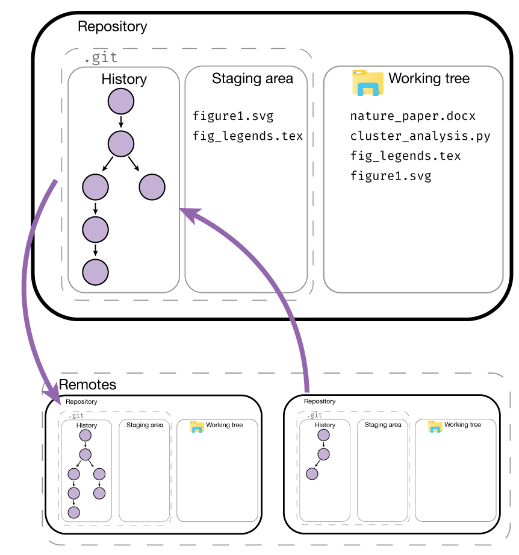
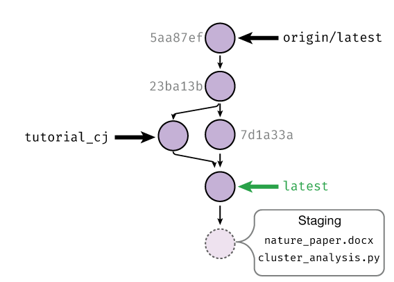
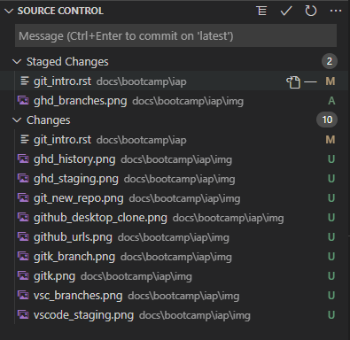
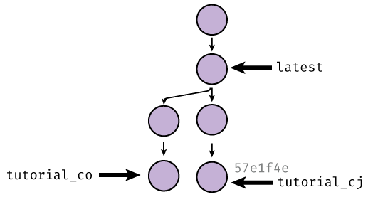

=======================
An introduction to Git
=======================

Acknowledgements
----------------
This bootcamp session is heavily inspired by the
`Software Carpentry Git lesson <https://swcarpentry.github.io/git-novice>`__ (CC-BY-4.0).

The initial motivation section is inspired by
`The Git Parable <https://tom.preston-werner.com/2009/05/19/the-git-parable.html>`__.

Motivation
----------
Even if you haven't used version control software before, you have probably encountered two
types of version control:

1. Linear time-based snapshots. This can either be manually done (e.g. you append a
   date to documents and copy files when you want to make a new version), or automatically
   done (e.g. you are storing documents in Dropbox, and it stores time snapshots for the
   last 30 days automatically).
2. Online, live multi-person editing, like in Overleaf and Google Drive.

These techniques are useful, but have limitations. Time-based snapshots often fail if you want
to have multiple people editing simultaneously without massive headaches, and online live editing
only works if you have permanent internet access, intermediate states are meaningful (e.g. saving
mid-sentence is fine for manuscripts, but would throw a syntax error for code), and you don't
actually care about saving a detailed history.

For us, having robust version control without these limitations makes our coding work easier to share,
easier to reproduce (how do you regenerate a plot made with a previous code version you
didn't know you needed?), and easier to do shared work.

In the CS community, this is a solved problem; the field has coalesced around using the 
version control system called ``git``. There are competing version control systems, including
Subversion, Mercurial, and Fossil, but ``git`` has emerged as the clear winner with the emergence
of supporting webservices Github, Sourceforge, GitLab, and others.

Unfortunately for us, ``git`` is also by far the most powerful and complicated version control system,
so before jumping into ``git`` commands, let's consider an example:

    Git is a simple, but extremely powerful system. Most people try to teach
    Git by demonstrating a few dozen commands and then yelling “tadaaaaa.”
    I believe this method is flawed. Such a treatment may leave you with the ability
    to use Git to perform simple tasks, but the Git commands will still feel like
    magical incantations. Doing anything out of the ordinary will be terrifying.
    Until you understand the concepts upon which Git is built, you’ll feel like a
    stranger in a foreign land.

    -- Tom Preston-Werner, `The Git Parable <https://tom.preston-werner.com/2009/05/19/the-git-parable.html>`__

Say you are trying to do version control for files related to a paper manuscript.
You have some figures, and a main ``.docx``

.. code-block::
    :class: box-spacing-override

    .
    ├─ figure1.ai
    ├─ figure2.ai
    └─ manuscript.docx

How should you track the version history of this? First create a new directory/folder, which is
called ``working`` here, as it is the directory you would be actively working on/editing.

.. code-block::
    :class: box-spacing-override

    .
    └─ working
       ├─ figure1.ai
       ├─ figure2.ai
       └─ manuscript.docx

After some hacking in Illustrator, you're happy with the way the figures look. To save this version, you
just copy the entire working folder to a ``snapshot-01`` folder and promise yourself that you won't further
edit what is inside the snapshot folders.

.. code-block::
    :class: box-spacing-override

    .
    │─ snapshot-01
    │  ├─ figure1.ai
    │  ├─ figure2.ai
    │  └─ manuscript.docx
    └─ working
       ├─ figure1.ai
       ├─ figure2.ai
       └─ manuscript.docx

After you do some more work, (some directories are shown collapsed, without showing content), such
as adding new figures, you might have lots of snapshots:

.. code-block::
    :class: box-spacing-override

    .
    │─ snapshot-01
    │─ snapshot-02
    │─ snapshot-03
    │─ snapshot-04
    │  ├─ figure1.ai
    │  ├─ figure2.ai
    │  ├─ figure3.ai
    │  └─ manuscript.docx
    └─ working
       ├─ figure1.ai
       ├─ figure2.ai
       ├─ figure3.ai
       └─ manuscript.docx

How are you supposed to remember what we changed in each of these? To help yourself,
you decide to add a new file, ``message.txt`` to each snapshot created. Inside the message,
you decide to add the date, our name, and some free-form message that describes what happened
in that version snapshot. A ``message.txt`` might look like:

::

    Author: Christopher Johnstone <cjohnsto@mit.edu>
    Date:   Jan 11 2021

        Made Figure 3 300% more aesthetic!

The snapshots now look like the following.
Note that we add the ``message.txt`` after we copy the working folder to a new snapshot folder.

.. code-block::
    :class: box-spacing-override

    .
    │─ snapshot-01
    │─ snapshot-02
    │─ snapshot-03
    │─ snapshot-04
    │─ snapshot-05
    │  ├─ message.txt
    │  ├─ figure1.ai
    │  ├─ figure2.ai
    │  ├─ figure3.ai
    │  └─ manuscript.docx
    └─ working
       ├─ figure1.ai
       ├─ figure2.ai
       ├─ figure3.ai
       └─ manuscript.docx

After some more work, you end up revising the manuscript while also trying out a new
revision of ``figure1.ai``. You want to save your updated manuscript version, but the
figure isn't quite ready yet. How do we save the manuscript edits into a snapshot while
leaving the in-progress figure edits out of the snapshot? There isn't an obvious
way to do this with this folder setup, so you decide to make another special directory
called ``stage`` (as in a stage to set and later snapshot).

With the edits marked with a ``*``, we initially have:

.. code-block::
    :class: box-spacing-override

    .
    │─ snapshot-01
    │─ snapshot-02
    │─ snapshot-03
    │─ snapshot-04
    │─ snapshot-05
    │  ├─ message.txt
    │  ├─ figure1.ai
    │  ├─ figure2.ai
    │  ├─ figure3.ai
    │  └─ manuscript.docx
    │─ stage
    │  ├─ figure1.ai
    │  ├─ figure2.ai
    │  ├─ figure3.ai
    │  └─ manuscript.docx
    └─ working
       ├─ *figure1.ai
       ├─ figure2.ai
       ├─ figure3.ai
       └─ *manuscript.docx

Now instead of directly copying the ``working`` folder into a snapshot, we first
copy the changes we want into ``stage``, while leaving files we are still actively
editing in ``working``. Copying the modified manuscript to ``stage``:

.. code-block::
    :class: box-spacing-override

    .
    │─ snapshot-01
    │─ snapshot-02
    │─ snapshot-03
    │─ snapshot-04
    │─ snapshot-05
    │  ├─ message.txt
    │  ├─ figure1.ai
    │  ├─ figure2.ai
    │  ├─ figure3.ai
    │  └─ manuscript.docx
    │─ stage
    │  ├─ figure1.ai
    │  ├─ figure2.ai
    │  ├─ figure3.ai
    │  └─ *manuscript.docx
    └─ working
       ├─ *figure1.ai
       ├─ figure2.ai
       ├─ figure3.ai
       └─ *manuscript.docx

then we make a new snapshot from ``stage``:

.. code-block::
    :class: box-spacing-override

    .
    │─ snapshot-01
    │─ snapshot-02
    │─ snapshot-03
    │─ snapshot-04
    │─ snapshot-05
    │  ├─ message.txt
    │  ├─ figure1.ai
    │  ├─ figure2.ai
    │  ├─ figure3.ai
    │  └─ manuscript.docx
    │─ snapshot-06
    │  ├─ message.txt
    │  ├─ figure1.ai
    │  ├─ figure2.ai
    │  ├─ figure3.ai
    │  └─ *manuscript.docx
    │─ stage
    │  ├─ figure1.ai
    │  ├─ figure2.ai
    │  ├─ figure3.ai
    │  └─ *manuscript.docx
    └─ working
       ├─ *figure1.ai
       ├─ figure2.ai
       ├─ figure3.ai
       └─ *manuscript.docx

Finally, this whole setup seems to be working well, and you want to go share your work
with fellow lab-mates. While you could just copy the entire folder and share created
snapshots, this would be inherently linear; only one person could work on this at a
certain time! To solve these issues, among others, you decide to assign arbitrary, unique
names to snapshots, such as ``2a8aba``. With these arbitrary names, it's hard to tell what
order you made the snapshots in, so you also add a ``parent`` field.

.. code-block::
    :class: box-spacing-override

    .
    │─ snapshots
    │  ├─ c3612a
    │  │─ 86ac2d
    │  │─ acd748
    │  │─ fb9742
    │  │─ 12d276
    │  │  ├─ message.txt
    │  │  ├─ figure1.ai
    │  │  ├─ figure2.ai
    │  │  ├─ figure3.ai
    │  │  └─ manuscript.docx
    │  └─ 2a8aba
    │     ├─ message.txt
    │     ├─ figure1.ai
    │     ├─ figure2.ai
    │     ├─ figure3.ai
    │     └─ *manuscript.docx
    │─ stage
    │  ├─ figure1.ai
    │  ├─ figure2.ai
    │  ├─ figure3.ai
    │  └─ *manuscript.docx
    └─ working
       ├─ *figure1.ai
       ├─ figure2.ai
       ├─ figure3.ai
       └─ *manuscript.docx

After this renaming, the most recent ``message.txt`` (in ``snapshot-06``, renamed to ``2a8aba``)
could read:

::

    Snapshot: 2a8aba
    Parent: 12d276
    Author: Christopher Johnstone <cjohnsto@mit.edu>
    Date:   Jan 12 2021

        Updated the manuscript with method details.

Now this gets confusing now; what was the last snapshot we took? To fix that, let's start a file, conveniently
called ``branches.txt``. Its contents could be:

::

    last: 2a8aba

That way, when we are ready to make a snapshot, we use the ``last`` pointer and set that as the parent.
Once we have the snapshot name, we write over the entry in ``last``.

What happens if someone else happens to also be working on these files? This is fine; it just means
that each person will have their own ``last`` pointer.

We can extend our pointer file such that everyone can **simultaneously edit** and keep
track of where they are in history by having a different 'pointer' in the branches file!

Summary
*******
This example has hopefully indicated a couple useful properties of a version control system:

* Taking **snapshots** instead of file-level versions ensures that every file is tracked in its\
  correct context.
* Having multiple people work on the same project, or working on different parts of a project naturally
  leads to a system where we have a **non-linear, branched** history.
* It is useful to have a separation between the files we are ready to snapshot (e.g. the **staged changes**)
  and files we are not ready to snapshot (**unstaged** or **untracked**).

Keeping this in mind, we're ready to jump into Git; our little toy system is actually pretty representative 
of how Git keeps track of things.

Git by example
--------------

We will start you off learning Git by editing the very repository we are working on!

Prereqs
*******
You should have a graphical Git tool installed, such as GitHub Desktop. You can also use the built-in
Git tools in something like VS Code. You also should have **command line git** installed; there are
certain functions that are really only possible through the command line interface, even though much
of it can be done through the graphical tools.

Then, you should check that your Git global settings are set properly. Start off by seeing what the
editor, name, and email settings you currently have. An example of the output is as follows:

.. code-block:: console

    $ git config core.editor
    vim
    $ git config user.name
    Christopher Johnstone
    $ git config user.email
    meson800@gmail.com

If your name and email are not set properly, set them with the following commands. Set
your email equal to one that you have connected to your GitHub, so your commits are properly
attributed:

.. code-block:: console

    $ git config --global user.name "Your Name"
    $ git config --global user.email "your_email@invalid.com"

Also, for the purposes of this bootcamp session, you should set your editor to a command line
editor. Unless you know how to use ``vim``, this should probably be set to ``nano``:

.. code-block:: console
    
    $ git config --global core.editor "nano -w"

Finally, we'll be editing this documentation! To do so, make sure that you have Python
installed and the following packages installed:

.. code-block:: console

    $ pip install sphinx sphinx-rtd-theme sphinx-last-updated-by-git

Basic Git terms
---------------

Thinking back to our example earlier, we had the concept of wanting to track
everything within a folder, and we took various snapshots of this folder.

In Git, we call the entire set of files and folders that we are interested
in a **repository**, or **repo** for short. Typically, repositories are going
to include everything related to a single project. This could mean a set of
analysis scripts for the same project, an entire R package that is being developed,
or more exotic things like paper and figure drafts.

On a brief note, Git is a version control system for **plain text files**, which
is a broad category of files that are readable by humans as well as machines. While
Git does still work on other so-called **binary files** (like pictures, PDFs, docx's,
and so on), Git is inefficent at versioning these types of files and you lose
a lot of the power of Git, like seamless merging of simultaneous changes.

That being said, if it is plain text, such as all code, ``.txt`` files, LaTeX files,
it could be a good fit for Git.

In our analogy, we had the **working tree**, e.g. the folder we are actively editing
next to folders for the **staging area** and the various snapshots we took.

In Git, the files that make up the staging area and history are stored within the subdirectory ``.git``.
By default, this folder is hidden, though you can show it if you want. The rest of the
files in the repository folder form the **working tree**.

Downloading or starting a repository
------------------------------------
If you wanted to start a new fresh repository, you can start a new repository
by calling ``git init``:

.. code-block:: console

    $ mkdir a_new_repo
    $ cd a_new_repo
    $ git init
    Initialized empty Git repository in ~/a_new_repo/.git

If you start a fresh repository, you must add and commit some content
before trying to push to a remote like Github; otherwise there is nothing
to push!

You can also do this via a graphical interface.

.. image:: img/git_new_repo.png
    :align: center

The graphical interface gives the additional option to start with some content
pre-generated, in particular a **copyright license** and a **.gitignore** file. We will
cover the ignore file later. If you choose one of these options, you can immediately
push to a remote, because there is content to push!

For the purposes of this demo, we will be modifying the protocols website! If a repository
already exists somewhere else, you can **clone** the repository to make a local version of it.

To clone a repository, we have to know where it is located. There's many possible ways to access
another remote repository; it could be on a shared drive location, or accessible on a server. By
far the most common location for remotes is on websites like Github. To find the URL, we can
look on the website and click the green code button:

.. image:: img/github_urls.png
    :align: center

If you have added an SSH key to your Github account, you can use the ``ssh`` URL:

``git@github.com:GallowayLabMIT/protocols.git``.

If you haven't added an SSH key, you can use the https URL:

``https://github.com/GallowayLabMIT/protocols.git``

To clone a repository, you use ``git clone``. By default, it will create a new folder equal to the repository name:

.. code-block:: console

    $ ls
    $ git clone https://example.com/example/example_repo.git
    Cloning into 'example_repo'...
    remote: Enumerating objects: 14, done.
    remote: Counting objects: 100% (14/14), done.
    remote: Compressing objects: 100% (11/11), done.
    Receie: Total 1144 (delta 3), reused 12 (delta 3), pack-reused 1130 eceiving objects: 100% (1144/1144)
    ving objects: 100% (1144/1144), 6.53 MiB | 16.39 MiB/s, done.
    Resolving deltas: 100% (562/562), done.
    $ ls
    example_repo

If the remote repository is stored on Github, you can also use Github Desktop to clone a repository:

.. image:: img/github_desktop_clone.png
    :align: center

.. admonition:: Exercise

    1. Create a new repository using the command line. What is the contents of the hidden ``.git`` folder?
    2. Create a new repository using a graphical tool like Github Desktop
    3. Delete both of these repositories.
    4. Clone this protocols repo, using either the terminal or a graphical tool.

    .. raw:: html

        

        
Show/hide answer

    1. The ``.git`` folder contains several text files encoding the current branch
       among other information, with several folders that store the history.

    .. code-block:: console

        $ ls .git
        branches  config  description  HEAD  hooks  info  objects  refs
    
    2. Completed with Github Desktop.
    3. Completed with delition through the file manager or with ``rm`` in the terminal.
    4. Unless you have SSH, the following is the correct command:

    .. code-block:: console

        $ git clone https://github.com/GallowayLabMIT/protocols.git
        Cloning into 'protocols'...
        remote: Enumerating objects: 14, done.
        remote: Counting objects: 100% (14/14), done.
        remote: Compressing objects: 100% (11/11), done.
        Receie: Total 1144 (delta 3), reused 12 (delta 3), pack-reused 1130 eceiving objects: 100% (1144/1144)
        ving objects: 100% (1144/1144), 6.53 MiB | 16.39 MiB/s, done.
        Resolving deltas: 100% (562/562), done.

    .. raw:: html

        

Basic history terms and git status: What's happening?
-----------------------------------------------------

Now that we've cloned the protocols repository, we can start poking around.

Whenever you are feeling lost, you should use the ``git status`` command. The output
is generally more concise than the output of many of the graphical tools. In this case,
if we run the status command we will get:

.. code-block:: console

    $ git status
    On branch latest
    Your branch is up to date with 'origin/latest'.

    nothing to commit, working tree clean

What does this mean? Let's take a look at an example history graph:

    An example history is shown. Each commit has a random name (in gray) that
    is assigned by Git. Shown with arrows are the various **branches**, which
    can be thought of as movable commit names. Shown in green is the currently
    checked out branch; staged changes will be committed on top of this branch.

This is a pretty picture; how do we actually understand what is happening in the
repository we just checked out? For this, we'd like to actually view the history.

We view the history using either graphical tools or using the ``git log`` command. Let's play around
with the command line first! When you type ``git log``, you will be in an interactive browser, use the
arrow keys to scroll up and down, and press ``q`` to exit.

By default, ``git log`` prints out the entire author and commit message of the previous commits:

.. code-block:: console

    $ git log
    commit 51313751defcf0798fce66c517abd0a20dd1feb1 (HEAD -> latest, origin/latest)
    Author: Christopher Johnstone <meson800@gmail.com>
    Date:   Mon Feb 15 23:38:29 2021 -0500

        Removed assumptions about working directory from build script

    commit 5031d35ad03e53a25ab748c57dea4cbf31b8b33b
    Author: katiegal <katiegal@mit.edu>
    Date:   Mon Feb 15 23:10:30 2021 -0500

        N3 table alignment

    commit 756662c5c9f16a7adca2849863d07123a0a2815d
    Author: katiegal <katiegal@mit.edu>
    Date:   Mon Feb 15 23:08:01 2021 -0500

        N3 table formatting

If we want a more concise view, we can tell Git this with the ``--oneline`` option:

.. code-block:: console

    $ git log --oneline
    5131375 (HEAD -> latest, origin/latest) Removed assumptions about working directory from build script
    5031d35 N3 table alignment
    756662c N3 table formatting
    5aa87ef formating of N3
    74434ec Formatting repsox table
    76541e4 typos fixed in repsox protocol
    fa70197 Formatted RepSox info
    77ac72b added RepSox concentrations
    e0a749e Merge branch 'master' into latest
    a8b29e4 Updating awesome RNA vs DNA image!
    70075b9 Added BSA requirement for neurotrophics
    0e96845 Removed settings.json from tracking and .vscode

Here, we see that we have a short name for each commit (the first 7 characters of the full name),
and just the commit message, with no author attribution.

To see the whole branching layout, we can view the log with the ``--graph`` option. If we combine
these two options, we can get a short graph view!

.. code-block:: console

    $ git log --graph --oneline
    * 5131375 (HEAD -> latest, origin/latest) Removed assumptions about working directory from build script
    * 5031d35 N3 table alignment
    * 756662c N3 table formatting
    * 5aa87ef formating of N3
    * 74434ec Formatting repsox table
    * 76541e4 typos fixed in repsox protocol
    * fa70197 Formatted RepSox info
    * 77ac72b added RepSox concentrations
    *   e0a749e Merge branch 'master' into latest
    |\  
    | * a8b29e4 Updating awesome RNA vs DNA image!
    | * 70075b9 Added BSA requirement for neurotrophics
    * | 0e96845 Removed settings.json from tracking and .vscode
    * | e9ca614 Fixed formatting
    * | 14a7bad Use currently running python interpreter to run sphinx
    * | 667a652 (origin/tech_wip) Added details on no-spaces rationale
    * | 9a3dda0 Switched ISO date to explicitly link to xkcd
    * | 55bb3eb Updated shell and software tips and tricks with shell extras
    * | f65c1e5 Added helper script run info

In this example graph view, we see that two branches came together at commit ``e0a749e``.

We can use various GUI programs to get the same result! In Github Desktop, you can switch to the
history tab to see a linearized history (e.g. like the default ``git log``):

.. image:: img/ghd_history.png
    :align: center

You can also run ``gitk`` in a terminal to bring up a different graphical view which shows the entire tree:

.. image:: img/gitk.png
    :align: center

In summary, ``git log`` and ``git status`` and their GUI equivalents should be your go-to tool
to find out what is happening in history. If you are ever feeling confused, take a look at the log!

.. admonition:: Exercise

    Do the following with the ``git log`` command or one of the graphical tools.

    1. Find a "fork" in the history graph, where two different commit branches came together, other than the example given.
       Which commit did the merge occur at?
    2. What was the second commit in the protocols repository?
    3. Find the embedded emails of two contributors to the protocols repo.

    .. raw:: html

        

        
Show/hide answer

    1. One example is this one, shown in graph form with Gitk:

    .. image:: img/gitk_branch.png
        :align: center

    2. The second commit in the repo is the following:

    .. code-block::

        commit 5a9a7f55fb53333ef9c642d019d9af67aa64a2a4
        Author: Christopher Johnstone <meson800@gmail.com>
        Date:   Fri Feb 14 10:43:13 2020 -0500

            Updated navigation system to use a protocols dropdown

    3. Answers will vary. You should use the full git log view to find these.

    .. raw:: html

        

Branching out, adding, and checking out files
---------------------------------------------
Now that we know how to view history, let's start making some history! We'll start
by adding a convenient name to the commit we are on, so we don't have to refer to these snapshots/commits
by their full name.

We view branches and create new branches with the ``git branch`` command. Typing ``git branch``
by itself returns all of the current branches, with a star next to the currently active branch:

.. code-block:: console

    $ git branch
    * latest
    tech_wip
    gh_pages

Since we haven't done anything to this repository yet, we start off in the **default branch**.
For the protocols repository, the default branch is ``latest``: this naming derives from a relatively
common naming scheme for documentation where the most recent branch is called ``latest``.

Other default branches you may see include ``master`` and ``main``; the default moving forward
on our repos is ``main``.

.. admonition:: Sidenote

    Historically, the default branch name has been called ``master``. In the summer of 2020, the Software Freedom
    Conservancy `recommended <https://sfconservancy.org/news/2020/jun/23/gitbranchname/>`__ that
    the branch name ``master`` be replaced with ``main`` because of its possible link to master-slave. Strictly speaking,
    the etymology is likely referring to **master recording** or **mastering**, both audiovisual
    production terms, but ultimately changing branch names is a minor change that can be made with
    major benefits for inclusivity in our community.

        I wanted to conclude that, at the end of the day, it doesn't matter
        where the name comes from (something that was touched upon a number of
        times in the thread). The fact that it has bad connotations, or
        inspires dread for individuals and whole communities, is reason enough
        to change it.

        -- Bastien Nocera, https://mail.gnome.org/archives/desktop-devel-list/2020-June/msg00023.html

If you want to create a new branch, you do so by adding a name after the branch command:

.. code-block:: console

    $ git branch
    * latest
    $ git branch tutorial_cj
    $ git branch
    * latest
    tutorial_cj

Note that creating a new branch **does not switch to it**. To actually switch branches, we need to tell Git
to update the directory we actually see (the **working tree**). We do this with the **checkout** command:

.. code-block:: console

    $ git branch
    * latest
    tutorial_cj
    $ git checkout tutorial_cj
    $ git branch
    latest
    * tutorial_cj

There are GUI equivalents of these commands. In Github Desktop, you get here by pushing on the branch button:

.. image:: img/ghd_branches.png
    :align: center

Inside VS Code, you can access this functionality with the drop down menu inside the source control tab:

.. image:: img/vsc_branches.png
    :align: center

.. admonition:: Exercise

    To do some of the later merging steps, it helps to find a partner for this step! If you don't have a partner,  you can clone the repository into
    a separate folder to simulate multiple peoplele.

    1. Have one of the partners create a new branch, deciding on a specific name  between the two (suggestion: ``tutorial_xx_yy`` for initials ``xx`` and ``yy``).
    2. For future setup, have the partner that created the branch run:
    
    .. code-block:: console
    
        $ git push --set-upstream origin tutorial_xx_yy
        Enumerating objects: 28, done.
        Counting objects: 100% (28/28), done.
        Delta compression using up to 8 threads
        Compressing objects: 100% (19/19), done.
        Writing objects: 100% (22/22), 2.03 KiB | 346.00 KiB/s, done.
        Total 22 (delta 13), reused 1 (delta 0), pack-reused 0
        remote: Resolving deltas: 100% (13/13), completed with 5 local objects.
        remote:
        remote: Create a pull request for 'tutorial_xx_yy' on GitHub by visiting:
        remote:      https://github.com/GallowayLabMIT/protocols/pull/new/tutorial_xx_yy
        remote:
        To https://github.com/GallowayLabMIT/protocols.git
        * [new branch]      tutorial_xx_yy -> tutorial_xx_yy
        Branch 'tutorial_xx_yy' set up to track remote branch 'tutorial_xx_yy' from 'origin'.

    3. Again, for future setup, have the other partner pull this update and checkout the same branch:
    
    .. code-block:: console

        $ git pull
        $ git checkout tutorial_xx_yy

    3. With both a terminal and another GUI tool, repeatedly checkout/switch between ``latest`` and the new
       branch you created.

Now how do we start making changes? Remember that when we make changes in the (working) directory, we have to explicitly tell Git which changes
we would like to snapshot. We inform Git of which changes we want(e.g. we *stage* the changes) using the ``git add`` command.

.. note::

    Git reports changes in files in two ways. If a file has already been included in a previous snapshot, then changes to that file are marked
    as changes. If a file has *not* been included in a previous snapshot, then it appears as an **untracked file**. Even though these are two
    different types of changes, we use the same command, ``git add`` to add both of them.

Assume that we are tracking the file ``test.txt`` (e.g. we have ``git add``'ed it in the past, but not ``new.txt``. Then
the status command will look like:

.. code-block:: console

    $ git status
    On branch latest
    Your branch is up to date with 'origin/latest'.

    Changes not staged for commit:
    (use "git add <file>..." to update what will be committed)
    (use "git restore <file>..." to discard changes in working directory)
            modified:   test.txt

    Untracked files:
    (use "git add <file>..." to include in what will be committed)
            new.txt
    $ git add test.txt new.txt
    $ git status
    On branch latest
    Your branch is up to date with 'origin/latest'.

    Changes to be committed:
    (use "git restore --staged <file>..." to unstage)
            modified:   test.txt
            new file:   new.txt

We can do the same thing in the GUI tools. In Github Desktop, changes are staged automatically:

.. image:: img/ghd_staging.png
    :align: center

VS Code has a clearer interface. In the source control tab, the new changes appear under the "Changes"
column. By hovering over files, you can use the plus icon to add/stage the changes.

.. image:: img/vscode_staging.png
    :align: center

How do we remove our changes from being staged?  In Github desktop, you can uncheck changes to unstage them.
In VS Code, hovering over a staged change will give a minus button that unstages:

If we want to do this from the terminal, we can follow the suggestion given by ``git status``:

.. code-block:: console

    $ git restore --staged test.txt

Note that unstaging doesn't actually remove the changes, they are still in your working tree! It just removes it
from the set of changes you want to snapshot.

.. admonition:: Exercise

    1. Edit this file (``docs/bootcamp/iap/git_intro.rst``), adding your name below:

       ::
       
            Christopher Johnstone, Another name?
    
    2. Add a new protocols file. It could be something random, or something the lab needs.
    3. Using the terminal, **stage** these changes, e.g. adding them to the list of changes to snapshot.
    4. Using a graphical tool, unstage and then re-stage these changes.

Snapshotting your work
-----------------------
Now that we've staged changes to be snapshotted, we need to actually perform the snapshot. We do this with the
``git commit`` command, or through one of the tools. Let's start with the terminal!

To make a new commit, you can just type ``git commit``:

.. code-block:: console

    $ git commit
    <editor opens. After you save and close the editor>
    [latest 2cdfda4] Edited an in-progress version of git_intro, up to commiting
    2 files changed, 491 insertions(+), 9 deletions(-)

When you run ``commit`` in this way, it will open up a text editor (which should be Nano, following the prereqs) and ask you
to type in a message. After you are done, you can save and exit from the editor, and the commit completes. You will
see a short summary, including the branch name, the short version of the commit name (the random string), the first line
of your commit message, and a summary of how many files and line-based changes were made.

If you have a short commit message already in mind, you can skip the editor step by directly adding a message after the ``-m`` or ``--message``
flag:

.. code-block:: console

    $ git commit -m "Here's a short commit message!"
    [latest 73ca1a9] Here's a short commit message!
    1 file changed, 100 insertions(+)

In the various GUI tools, there is often a box to type in your commit message. For example, in VS Code, you can type in a message in the message
box, adding newlines as required with enter, submitting the commit by pushing control-enter:

In Github Desktop, if you made a change to a single file, it will auto-suggest a default commit message. **Don't use this default message!** The suggested
commit message is not descriptive:

.. image::img/ghd_default_commit_message.png
    :align: center

Think of your commit messages as comments to either future you or other collaborators for your overall changes. We wouldn't write code comments like:

.. code-block:: python

    pi = 3.1415 # Sets the pi variable equal to the 5-digit truncated value of pi

so don't write commit comments like "Updated such and such file"; instead try to add the **why** you made this commit.

.. admonition:: Exercise

    1. Commit your changes, adding a relevant commit message using your interface of choice. What is the name of your newly created commit?
    2. After commiting all of your changes, try committing again. What happens?
    3. Make some more changes in a file, such as this one. Add and commit these changes with another interface.

    .. raw:: html

        

        
Show/hide answer

    1. This could be done with:
    
    .. code-block:: console
        
        $ git commit -m "Your commit message here"
    
    The output of this command will include the commit name!

    2. When committing with no new changes, you will get a (nice) error message:
    
    .. code-block:: console

        $ git commit -m "Nothing here?"
        On branch latest

        nothing to commit, working tree clean

    3. Answers will vary.

    .. raw:: html

        

Ignoring files
--------------
What happens to files we **don't** want to track version history on? Why would we not want to track history?

A good example of files that you don't want to track is temporary files. On MacOS, browsing to a folder
using Finder creates hidden ``.DS_Store`` files, which store information like the x-y position of files
within the Finder window. Programming languages also generate temporary files that do not need to be
tracked by Git. For example, Python will sometimes compile ``.pyc`` or ``__pycache__`` files that speed
un script execution. These files, however, do not need to be tracked as they are derived from the "real"
source code. Similarly, we do **not** want to track the website or PDF output of this repository in source control,
given that we build these outputs from the source code anyway.

Git will not track these until you add them, but they will always annoyingly sit in the ``git status`` output
unless you tell Git to ignore these files. We do this by adding files we want to ignore to a special hidden file, 
``.gitignore``. Each line in this file is matched against a file. If it appears on the ignore list, Git pretends
that it doesn't exist, making for nice clean history!

For example, the current ``.gitignore`` for this repository is as follows:

::

    .DS_Store

    # vscode ignores
    .vscode

    # Specific build gitignore
    output/

    # Python gitignore
    # Byte-compiled / optimized / DLL files
    __pycache__/
    *.py[cod]
    *$py.class

    # C extensions
    *.so

    # Distribution / packaging
    .Python
    build/

Because we use Sphinx/Python to build the website, we have several Python-specific temporary files to ignore, as
well as the output folder.

When creating a new repository on Github, you are given the option to start off with a language-specific ``.gitignore``. These
are generally a pretty good starting place; you can always add more ignore patterns as you go along!

Recovering history: reverting commits and file-level checkouts
---------------------------------------------------------------
Git is a wonderful tool for storing history, so you may be wondering how we go back to certain states.

In a typical Git workflow, we do not typically reset the entire branch state back to some previous commit. It
is possible to do this, but it is a **destructive operation** that removes history from the tree (e.g. removes some
commit nodes), so Git only lets you do it after you override several warnings.

Instead, Git provides utilities to **revert entire commits** and restore specific files from previous versions. In either case,
we simply add to the history (e.g. add more commits) that simply reverse previous changes.

To reverse the changes introduced by a commit, you can give a commit name after ``git revert``. As an example, consider
the following terminal example introducing, and then reverting a commit:

.. code-block:: console

    $ git add test.txt
    $ git commit -m "Just testing"
    [tutorial_cj 57e1f4e] Just testing
    $ git revert 57e1f4e
    [tutorial_cj a0afdee] Revert "Just testing"
     1 file changed, 1 addition(+)
    $ git log
    commit a0afdeee60ac8acb9be8066abb2a95fde70a2df8 (HEAD -> tutorial_cj)
    Author: Christopher Johnstone <meson800@gmail.com>
    Date:   Thu Feb 18 22:24:27 2021 -0500

        Revert "Just testing"

        This reverts commit 57e1f4ea06f25a7c05c6d03fcc297efa458bc8e4.

    commit 57e1f4ea06f25a7c05c6d03fcc297efa458bc8e4
    Author: Christopher Johnstone <meson800@gmail.com>
    Date:   Thu Feb 18 22:24:21 2021 -0500

        Just testing

Visually, what has happened is that we have gone from this tree:

to this one:

.. image:: img/git_post_revert.png
    :align: center

If you'd like to use a GUI tool to revert changes, you can do so! Going to the History tab in Github Desktop
and right-clicking on a commit gives you the ability to revert it:

.. image:: img/ghd_revert.png
    :align: center

How do we revert single file changes? We can use the same **checkout** command that we used to switch between branches, but this time
limit it to specific files. If we specify a commit name to checkout from and a list of files, Git will fetch the state
of those files from the previous commit. In the previous example, if we wanted to 

.. code-block:: console

    $ git checkout 57e1f4 test.txt
    Updated 1 path from 57e1f4e

Most GUI tools do not let you do specific-file checkouts; you have to use the terminal for this.

.. admonition:: Exercise

    1.  Create some change to a file in this repository; just really mash the keyboard, add this change, and commit it (New commit #1)
    2.  Make a second change to **another location** in the same file, add, and commit it. (New commit #2).
    3.  Using ``git log`` or any other tool, find name of New commit #1, and revert it.
    4.  Use a selective ``git checkout`` to checkout the version of the file prior to New commit #1 (e.g. before you edited it for this exercise).
    5.  Commit this change.
    6.  You've now made four commits. What does your ``git log`` look like?

    .. raw:: html

        

        
Show/hide answer

    1. Say you edit the ``test.txt`` file. Then:
        
    .. code-block:: console

        $ git add test.txt
        $ git commit -m  "Some keyboard mashing"
        [latest e033746] Keyboard mashing
        1 file changed, 1 insertion(+)
    
    2. After making a second change:

    .. code-block:: console

        $ git add test.txt
        $ git commit -m "A second change"
        [latest 2b2e177] A second change
        1 file changed, 1 insertion(+)
    
    3. We could look at our history, but we also  see the commit name (``e033746``) after our first commit. We revert this with:

    .. code-block:: console

        $ git revert e033746
        [latest ecd301c] Revert "Keyboard mashing"
        1 file changed, 1 deletion(-)
    
    4. Looking in our ``git log`` output, we see that the commit prior to "Keyboard mashing" is commit ``65c5e3f``. We checkout ``test.txt`` from there and commit:
    
    .. code-block:: console

        $ git checkout 65c5e3f test.txt
        Updated 1 path from 171189d
        $ git commit -m "Restored file back to its original version"
        [latest 2da20a3] Restored file back to its original version
        1 file changed, 1 deletion(-)
    
    5. The ``git log`` looks like:

    .. code-block:: console

        $ git log
        commit 2da20a30521b41bbdf973e560c7549e1be3a0a4b (HEAD -> latest)
        Author: Christopher Johnstone <meson800@gmail.com>
        Date:   Thu Feb 18 22:55:45 2021 -0500

            Restored file back to its original version

        commit ecd301c798d162fc547661f897de277789b09d4f
        Author: Christopher Johnstone <meson800@gmail.com>
        Date:   Thu Feb 18 22:52:53 2021 -0500

            Revert "Keyboard mashing"

            This reverts commit e03374683b76f9f2a3d70bafdb6ff257af90b0e4.

        commit 2b2e1778e4ce0df4c31a351b54c9e11e52c15678
        Author: Christopher Johnstone <meson800@gmail.com>
        Date:   Thu Feb 18 22:51:00 2021 -0500

            A second change

        commit e03374683b76f9f2a3d70bafdb6ff257af90b0e4
        Author: Christopher Johnstone <meson800@gmail.com>
        Date:   Thu Feb 18 22:49:12 2021 -0500

            Keyboard mashing
       
       The ``.git`` folder contains several text files encoding the current branch
       among other information, with several folders that store the history.

    .. raw:: html

        

Working with others: remotes and inevitable merge conflicts
-----------------------------------------------------------
At this point, how do we share our wonderful work with others? This normally involves
transferring our history with some central server.

Because Git has immutable history and we tend to only add new commits to the history tree,
integrating our changes with others is easy; the hard part is **merging** multiple people's changes together.

Taking a quick "big-picture" break, in Git, you can connect to other versions of your repo through something
called **remotes**. Any repository you want to interact with that is not your local version is called a **remote**.

If you initalize a new repository, it starts off with no remotes; it doesn't know about anything else! In this case,
we **cloned** the protocols repo, so we do have a remote; the location on Github! By default, the first remote
is called ``origin``, as it is the origin which you cloned from.

You can see details about your remotes using ``git remote``. Here, we'll add a ``-v`` flag to give more **verbose** output:

.. code-block:: console
    
    $ git remote -v
    origin  https://github.com/GallowayLabMIT/protocols.git (fetch)
    origin  https://github.com/GallowayLabMIT/protocols.git (push)

We see that Git has two (identical) URLs, one for pushing changes (e.g. local to remote) and one URL for receiving changes (remote to local).
In certain weird circumstances you might want these to be different URLs, but generally it's ok that they are the same thing.

To share your work with others, you **push** your branch *to the remote*. To get work from others, you **pull** the remote branch to yourself.

What happens if two people have both added their own local commits to a branch? Let's find out!
.. admonition:: Exercise

    One partner should push the shared branch first:

    .. code-block:: console

        $ git push
        Enumerating objects: 28, done.
        Counting objects: 100% (28/28), done.
        Delta compression using up to 8 threads
        Compressing objects: 100% (19/19), done.
        Writing objects: 100% (22/22), 2.03 KiB | 346.00 KiB/s, done.
        Total 22 (delta 13), reused 1 (delta 0), pack-reused 0
        remote: Resolving deltas: 100% (13/13), completed with 5 local objects.
        * [update]      tutorial_xx_yy -> tutorial_xx_yy
    
    What happens when the other person now tries to push?

    .. code-block:: console

        $ git push
        To https://github.com/GallowayLabMIT/protocols.git
        ! [rejected]        tutorial_xx_yy -> tutorial_xx_yy (fetch first)
        error: failed to push some refs to 'https://github.com/GallowayLabMIT/protocols.git'
        hint: Updates were rejected because the remote contains work that you do
        hint: not have locally. This is usually caused by another repository pushing
        hint: to the same ref. You may want to first integrate the remote changes
        hint: (e.g., 'git pull ...') before pushing again.
        hint: See the 'Note about fast-forwards' in 'git push --help' for details.

To explain this message, let's look at how the history changed. Initially, the branch on Github was where it was initalized
at the beginning, with each person having local commits:

.. image:: img/git_pre_push.png
    :align: center

The first person's push (A) set the remote branch ``origin/tutorial_xx_yy`` equal to **their** version of ``tutorial_xx_yy``:

.. image:: img/git_post_push.png
    :align: center

Then, when the second person (B)  went to  push, Git rejected the push because setting ``origin/tutorial_xx_yy`` to the location
of ``B/tutorial_xx_yy`` would erase A's changes! Git only allows so-called "fast-forward" pushes, where the branch pointer
moves down the tree without backtracking.

We solve this by having person B **pull** the changes. Starting a ``git pull`` will attempt to create a **merge commit** that
has two parents: the old ``B/tutorial_xx_yy`` and ``origin/tutorial_xx_yy``:

.. image:: img/git_merge_attempt.png
    :align: center

Git  is very smart about merging changes; it is capable of automatically merging relatively complicated scenarios,
such as one person moving a function within a file and another person editing within the same function. If this was
implemented like "Track Changes" in Word, everything would explode; the move would be marked as a deletion/insertion, which
would conflict with the other edits. Luckily, Git tracks this in a sane way.

However, sometimes Git cannot automatically merge changes. This most often happens when two commits edit the exact
same lines within a file. When this is a case, you will get a scary-looking message when you pull:

.. code-block:: console

    $ git pull
    Auto-merging docs/bootcamp/iap/git_intro.rst
    CONFLICT (content): Merge conflict in docs/bootcamp/iap/git_intro.rst
    Automatic merge failed; fix conflicts and then commit the result.

This long error message is just Git informing you that it could not automatically merge. 

If we run ``git status``, we will get more information on what to do:

.. code-block:: console

    $ git status
    $ git status
    On branch tutorial_xx_yy
    You have unmerged paths.
    (fix conflicts and run "git commit")
    (use "git merge --abort" to abort the merge)

    Unmerged paths:
    (use "git add <file>..." to mark resolution)
            both modified:   docs/bootcamp/iap/git_intro.rst

    no changes added to commit (use "git add" and/or "git commit -a")

It tells us that we have to **1)** fix the merge conflicts, **2)**, use ``git add`` to tell Git that we fixed
the conflicts, and **3)**, run ``git commit`` to finish the  merge.

How  do we know where the conflicts are? In each file listed as conflicted, Git added **conflict markers**,
which are ``<<<<<<<``, ``=======``, and ``>>>>>>>``. For example, a likely conflict you will get is in the name editing portion.
This means that the file now looks like:

::

        1. Edit this file (``docs/bootcamp/iap/git_intro.rst``), adding your name below:

        ::
        
    <<<<<< HEAD
                Christopher Johnstone, again?
    ======
                Christopher Johnstone
    >>>>>> test1
        
        2. Add a new protocols file. It could be something random, or something the lab needs.
        3. Using the terminal, **stage** these changes, e.g. adding them to the list of changes to snapshot.
        4. Using a graphical tool, unstage and then re-stage these changes.

Between the markers, you can see the two different versions of the file that conflicted. It is up to you,
the human, to decide what to do.

If you are using VS Code, these markers trigger special syntax highlighting:

.. image:: img/vs_code_conflict_resolution.png
    :align: center

If it is indeed the case that you simply want to take one change, deleting the other, you can use the options at the top to do so.
**However, this is often not what you want to do**. After doing whatever you think the correct merge is,
you should delete the marker lines.

After we have resolved the conflict, we can finish the commit:

.. code-block:: console
    
    $ git add docs/bootcamp/iap/git_intro.rst
    $ git commit

Finally, after we have a successful merge commit, the other partner can push their branch;
it is now a fast-forward and is accepted:

.. image:: img/git_post_merge.png
    :align: center

.. admonition:: Exercise

    .. code-block:: console

        $ git push
        Enumerating objects: 28, done.
        Counting objects: 100% (28/28), done.
        Delta compression using up to 8 threads
        Compressing objects: 100% (19/19), done.
        Writing objects: 100% (22/22), 2.03 KiB | 346.00 KiB/s, done.
        Total 22 (delta 13), reused 1 (delta 0), pack-reused 0
        remote: Resolving deltas: 100% (13/13), completed with 5 local objects.
        * [update]      tutorial_xx_yy -> tutorial_xx_yy

.. admonition:: Exercise

    1.  The other partner should run ``git pull``, resolve any merge conflicts, then push.
    2. After the other partner has pushed, the first partner should pull in the freshly-merged changes. You're done!

Conclusion
----------
Git is much more powerful, but these form the basics. Go and celebrate; you can now collaborate with  others
with code, while keeping the entire history safe :)