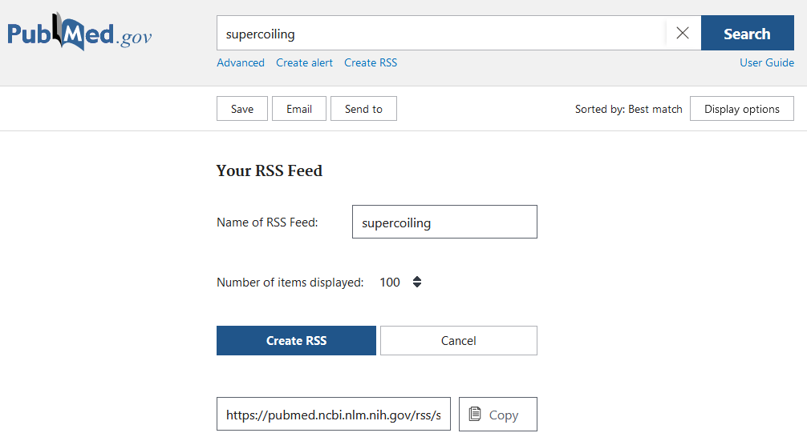
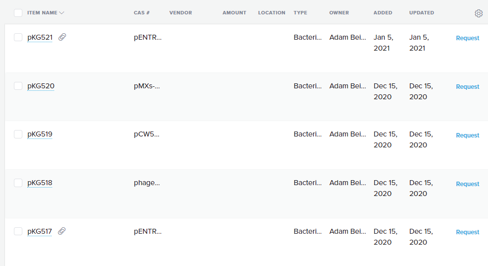
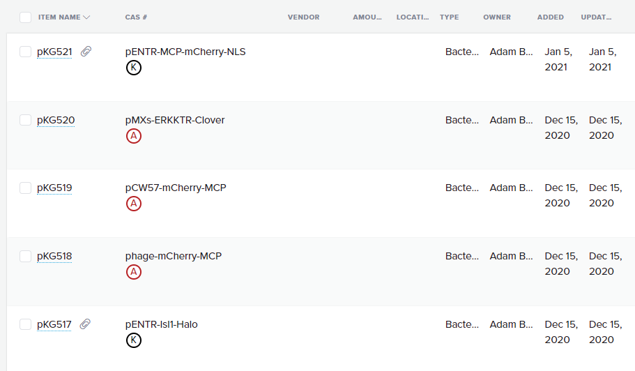

========================
Software Tips and Tricks
========================

One date format to rule them all/naming
---------------------------------------

.. figure:: https://imgs.xkcd.com/comics/iso_8601.png
    :align: center
    :target: https://imgs.xkcd.com/comics/iso_8601.png
    
    Courtesy of `xkcd <https://xkcd.com/1179/>`__

In file naming schemes, we typically use the ``YYYY-MM-DD`` format. The separators
don't typically matter, you could use dashes or underscores or periods.

This date format is both unambiguous and also sorts well (e.g. a lexicographic/alphabetical
sort sorts in the correct time order).

Finally, avoid using spaces in file and directory names! It's not a problem for most
code, but it's just a good best practice that makes typing these paths in easier
in a terminal.

Paper RSS feeds
---------------
Staying on top of the firehose of papers can be difficult. Using a RSS (Really Simple Syndication)
aggregator can be helpful. RSS is a relatively old technology that allows for websites
to push lists of content over time; the first podcasts were actually syndicated/released using RSS.

Most journals have RSS feeds; you can find it by searching for a journal name + ``rss``,
or by looking around with the RSS icon: |rss_icon|

.. |rss_icon| image:: https://upload.wikimedia.org/wikipedia/en/thumb/4/43/Feed-icon.svg/128px-Feed-icon.svg.png
    :align: middle
    :height: 2.0ex

For example, the main Nature feed lives at http://feeds.nature.com/nature/rss/current.

After finding some feeds you are interested in, you likely want to use a **feed aggregator**, something
that combines all of the new pushed papers into a single feed. A very popular feed aggregator is
`Feedly <https://www.feedly.com/>`_. It has a website and mobile apps. The free version is more than
sufficient for most purposes; it lets you combine up to 100 RSS feeds into 3 separate feeds.

You can also view feeds directly in Zotero! If you export your feed list from Feedly as a OPML
file, you can also direct-import it into Zotero.

.. image:: img/zotero_feeds.png
    :align: center

|

Creating feeds from searches
-----------------------------
Sometimes you want to have a feed of papers matching some search terms. You can easily do this
with Pubmed and ProQuest; whenever a new paper that matches your search terms
gets added, it will get added to your RSS feed aggregator. Unfortunately, Google Scholar
does not allow you to create RSS feeds (this would easily enable competition with their
services).

For Pubmed searches, start at https://pubmed.gov, and design your search. You may want
to be pickier; a search for just ``p53`` is going to return a lot of junk!

After you have a search of your liking, click the ``Create RSS`` button, and bump up the
returned number of items to 100. Then, you can directly use that feed URL in Feedly or Zotero!

To add a Proquest feed, you can go to https://search.proquest.com, make a search, then click the
"Save search/alert" button to create a RSS feed:

.. image:: img/proquest_rss.png
    :align: center

However, because Proquest is a MIT-sponsored database, you may have trouble accessing feed items
outside of the MIT network.

Zotero
------
There are several built-in features of Zotero that make paper reading more efficient.

1. **Color tags**: Zotero sometimes adds automatic tags based on article metadata, but you can also add tags of your own under
   the details menu. In addition, you can select up to 9 tags at any one time as quick/color tags. In the tag menu
   in the bottom left, right clicking on a tag lets you assign a number and a color; tagged entries will have small
   colored squares viewable at a glance.

   .. image:: img/zotero_tag_color.png
     :align: center

2. **Notes**:  When you add notes through the sidebar, they become fully searchable! You can
   also embed images and other content within notes. This is particularly helpful for summarizing papers; I use the
   following note template:
   ::

        Top line summary:

        What they did/highlights:

        Why do we care:

        Limitations:

        Extensions:

3. **Full-text searching**: The search bar has several available options through the dropdown. Switching to "everything"
   includes full-text searching of linked PDFs (e.g. it will look for phrases inside every linked PDF)!
4. **Tablet syncing**: If you install the Zotfile extension, you can setup automatic transfer and syncing
   with a tablet for annotation purposes. You will need some cloud syncing application (Dropbox, OneDrive, Google Drive)
   that is accessible both on your computer through your annotation app on your tablet. Point ZotFile at this folder,
   and it will automatically check for updates and pull the annotated PDFs back into Zotero.

   .. image:: img/zotero_tablet.png
    :align: center
|

Better Quartzy
---------------
While Quartzy is great for inventory purposes, and the interface for the plasmid
database isn't too bad, the web-interface leaves a lot to be desired. By default,
you can't really read the plasmid names even after you drag the CAS # field to the
second position:

To fix this, there is a Quartzy enhancer userscript that makes it look like the following!

The plasmid field is larger, and the plasmid resistance (Amp/Kan/Chlor) is listed directly
below the plasmid.

This feature is implemented using something called **userscripts**; these are small Javascript
scripts that get injected into webpages; effectively they are mini browser extensions.

First, you should install a userscript manager like `Tampermonkey <https://www.tampermonkey.net/>`__.

Then, you should be able to click on this link to add the userscript:
https://gist.github.com/meson800/f28e64d532da9b0fe2a1d22480ea5cda/raw/quartzy_enhancer.user.js

or in the Tampermonkey Utilities tab, you can use the **install from URL** option:

.. image:: img/tampermonkey_install_from_url.png
    :align: center
|

Regex help
----------
If you ever need help debugging or designing a regular expression, try using https://regex101.com/

YAML files
----------
Several lab workflows use YAML files to add metadata to images, flow data, etc. A quick tutorial can be found here: https://learnxinyminutes.com/docs/yaml/

Fonts
-----
Helvetica Neue is a good sans-serif font that is based on everyone's favorite font, Helvetica. 
Download it `here <../../_static/iap_files/HelveticaNeue.zip>`__. Windows needs a slightly different version of the fonts, available `here <../../_static/iap_files/WinNeue.zip>`__

For a good monospaced/code/terminal font, `Fira Code <https://github.com/tonsky/FiraCode/releases>`__ is excellent.
Besides looking nice, Fira Code has something called **font ligatures**. These are originally defined for special
letter combinations, like æ for adjacent ae. In Fira Code, common programming combinations are given
special ligature symbols that appear as you type normally. You often have to enable ligatures in the editor
you are using.

.. image:: img/fira_code.png
    :align: center
|

Activate SnapGene remotely
----------------------------
MIT uses a network license that can only be activated from an MIT IP address.
To activate remotely, you can tunnel traffic through the Athena cluster via the following:

1. Run ``ssh -D8080 KERBEROS@athena.dialup.mit.edu``

    .. image:: img/remote_snapgene_ssh.png
        :align: center

2. Login with your MIT password and do a Duo push in bash/powershell/etc. **Leave this window open.**

    .. image:: img/remote_snapgene_duo.png
        :align: center

3. Set your system proxy settings to use a SOCKS v5 proxy to localhost , port 8080

    .. image:: img/remote_snapgene_localhost.png
        :align: center

4. Check that the system proxy works by typing "what is my ip address" into Google. You should get an IP starting with 18

    .. image:: img/remote_snapgene_ip.png
        :align: center

