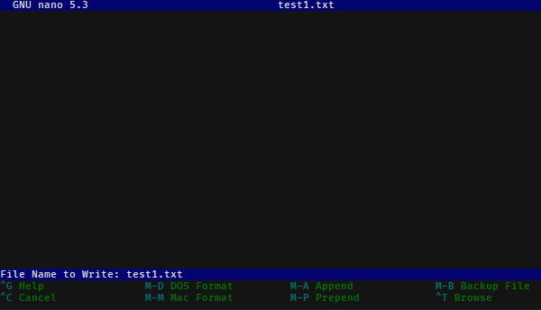

=======================
On Terminals and Shells
=======================

Motivation
==========
Knowing the basics of using a command line interface is occasionally helpful. While
a lot of software has nice GUI interfaces, making these interfaces
takes a large amount of work. Software written by a small number of people
(like research groups!) often are only accessible via a CLI.
In many cases, a command line interface can also be a faster way to do certain operations.

Even if you avoid using a terminal in daily computing, a terminal is often the only
way that you can access high performance computing clusters.

The basics
==========
Lots of words get thrown around: CLI, terminals, bash, shells, command prompts.
For these purposes:

* A **terminal** is the program that runs on your computer and
  handles all of the low-level input output details. It is responsible
  for drawing to the screen, getting keyboard input, handling the clipboard,
  selecting fonts, and so on.

  Common terminals might be the programs *Terminal*  or *iTerm2* on MacOS or
  *Windows Terminal*, *Powershell*, and *Command prompt* on Windows (more on this later).

* A **shell** is a command-line program (e.g. instead of interacting with us through a
  graphical interface, you type stuff in line by line) that lets the user take actions like
  modify files, view program output, run other command-line programs, and so on.

  Inside a terminal, you run a shell. Somewhat confusingly, the default terminals
  on both MacOS and Windows run a default shell, so that the shell and terminal appear
  identical.

  Common Unix shells (runnable on MacOS and Linux) are the original shell, ``sh``, along
  with ``bash`` (common default on Linux), ``zsh`` (recent default on MacOS), and others
  like ``csh`` and ``dash``. The two major Windows shells are ``cmd`` (old-school, going
  back to DOS) and ``powershell`` (Windows' modern shell).

.. figure:: img/shell_terminal.png
    :width: 80%

    An example of the difference between terminals and shells [#]_

When a shell starts it, it displays a **prompt**, showing that it is ready for input. Once you are done
typing in your command, you hit enter to run that command.

When you run a command line program, the shell will show the prompt again when it's ready for more input.
In these notes, we will use ``$`` to represent generic prompts (and ``>`` for the default Powershell prompt);
lines without the ``$`` are example output of what you will see when you enter the command.
When typing in commands, you should *not* type in the dollar sign! Your specific shell may display
a more complicated prompt than a dollar sign, such as showing the current directory that you are currently
in.

An example is:

.. code-block:: console

    $ echo "test"
    test

If we have an operating-system specific command to show, we'll show them in specific
boxes, and we'll use the Powershell prompt symbol ``>`` for the Powershell examples.

.. code-block:: console
    :class: bash-console

    $ echo "test"
    test

.. code-block:: console
    :class: powershell-console

    > echo "test"
    test

Finally, throughout this we will talk about **files** and **directories**. Directories are more
commonly known as **folders**, but **directory** is the common shell terminology, so will be used here
for consistency.
However, saying folder is totally fine unless someone is being *really* pedantic.

Commands
--------
In a shell, you enter commands to run them. When processing a line, the line you entered is
first separated by the spaces present. Consecutive spaces are treated as a single space, with
text in quotes being represented as a single "word".

Then, the first word is taken as the command name, and looked up in the list of installed
command-line programs (e.g. see if it is present in ``PATH``). The rest of the line is
given to that program as it's **command line arguments**.

By convention, command line arguments that start with dashes are normally **options**.
By convention, these options typically either have long names and start with two dashes,
or have a "shorthand" form with a single dash and a single letter. Arguments that don't start with dashes are typically user-specified.

For example, in the following commands:

.. code-block:: console

    $ git commit --message "Testing out a commit"
    $ git commit -m "Testing out a commit"

the command ``git`` is called in both cases, and is given the argument list:

(``commit``, ``--message``, ``Testing out a commit``) in the first case or
(``commit``, ``-m``, ``Testing out a commit``) in the second. These two calls
are identical in this case, because ``-m`` is shorthand for ``--message``.

.. admonition:: Demo

    For the command line commands:

    .. code-block:: console

        $ python -m venv env
        $ git add testing.py module.py "explanation revised.docx"
    
    what command is called in each case? What arguments are given to
    that command?

    .. raw:: html

        

        
Show/hide answer

        
    In the first example, the program ``python`` is ran with arguments (``-m``, ``venv``, ``env``).
    
    In the second example, the program ``git`` is ran with arguments (``add``, ``testing.py``, ``module.py``, ``explanation revised.docx``).

    .. raw:: html

        

Interface basics
================
While the shell is minimalistic, there are three features that make our
life easier:

1. **Job control**: Pressing Control and C (notated as ``Control-C``, ``Ctrl-C``, or ``^C``) does **not** copy inside
   a terminal. Instead, ``^C`` is the command to quit the actively running program. The program is given a chance to
   clean up after itself (e.g. this is like hitting the exit button in a program, not force-closing it).

   On Unix-derived systems (Linux and MacOS), you can additionally pause a running program by pressing ``Ctrl-Z``.
   When you pause the program, you will see ``[1]+  Stopped`` and you will be back at the shell prompt. To resume
   the program, type ``fg`` (to bring the program back to the **f**\ ore\ **g**\ round.

2. **Clipboard**: Because control-C does not copy, we need some other way of using the clipboard. On Mac, this is easy;
   copy and paste are typically bound to Command-C and Command-V. On Windows and Linux, it depends on what terminal you
   are using. A typical copy/paste solution binds the keyboard to right-click. On standard Powershell, you can select
   a region with your mouse and press enter to copy that to the clipboard. To paste, right click inside the terminal region.

3. **Tab completion**: Typing out full file names gets tiring, especially when you have long file names or
   deeply nested directory structures. Tab completion saves us: if you have a filename partially written, hitting
   ``Tab`` attempts to auto-fill the rest of the name. If there is a single unique file that matches what
   you have typed so far, that name is filled. If there are multiple files that might match, then the
   exact behavior differs per shell. Bash and similar shells will typically complete as much of the name as possible,
   but then stop. If you double-tap ``Tab`` in Bash, it will print a list of all possible matching files. In Powershell,
   pressing ``Tab`` cycles between files that match.

4. **History**: Retyping common commands also gets tiresome. You can access your command line history (e.g. the previous
   lines you have typed) by pressing the up and down arrows.

Starting off at home
====================
When you first open a terminal, your shell will likely start off in your **home directory**, also known in shorthand
as ``~``. Each user has its own home directory. All of the user directories that you are used to accessing through
Windows Explorer or Finder, such as ``Desktop``, ``Downloads``, or ``Documents`` are subdirectories of your home directory.

The actual location of your home directory differs,
but is typically something like ``C:\Users\Username`` on Windows, ``/users/Username`` on MacOS, and
``/home/Username`` on most Linuxes.

So that we don't have to type that large thing every time, ``~`` is short-hand notation for whatever your home
directory is. That is, the location of your downloads folder could be written either as ``C:\Users\Username\Downloads``
or more simply as ``~\Downloads``

.. note::
    You may have noticed earlier that these directory paths have been written differently between the
    two operating systems. In short, due to backwards compatibility, Windows uses the backslash ``\``
    as the path separator (written between directory names), whereas all Unix-derived operating systems
    including MacOS and Android use the forward slash ``/`` as the path separator.

    Most of the time you can just use the forward slash without worry; ``powershell`` on Windows will auto-convert
    from forward slashes to backslashes if you use forward slashes, but when programming you should keep this in
    mind and not manually use slashes when constructing paths to filenames. It still may work, but you should
    ideally use filesystem-aware techniques, like using ``os.path`` or ``pathlib`` in Python.

The shell has a current location; imagine it as having a Finder/Explorer window open to some directory
on your computer. This current location is called the (current) **working directory**. This is 
How do we know what directory we are in while using the shell? Our first command we will learn is ``pwd``:

.. admonition:: Command: ``pwd``

    ``pwd`` stands for **print working directory**, and does just that; it tells you what your current
    location is, in full detail (e.g. the entire path, not in shorthand). If you ever get lost, just type ``pwd``!

    This output is similar across operating systems; it is a little more verbose in Powershell.

    Example output right after launch, so that you are starting in your home directory:

    .. code-block:: console
        :class: bash-console

        $ pwd
        /users/username

    .. code-block:: console
        :class: powershell-console

        > pwd                                                                                     

        Path
        ----
        C:\Users\Username

If we want to know what is inside the current directory, we can use ``ls``:

.. admonition:: Command: ``ls``

    ``ls`` stands for **list**, and lists every file and directory inside the current working
    directory.

    If you were to run it in your home directory, you might get something like:

    .. code-block:: console

        $ ls
        Desktop    Downloads  Pictures
        Documents  Music      Videos
    
    If you want to see what is inside one of these directories, ``ls``
    takes command line arguments specifying which directory you'd like the view:

    .. code-block:: console

        $ ls Documents
        10-50     10-40   10-34
        research
    
    To view **hidden files** (on MacOS/Linux, these are files/directories that start with a period;
    on Windows, these are files/directories with a hidden attribute set), we need to pass
    ``ls`` a command line option. This differs between shells, but on bash/zsh/etc, you use ``--all`` or ``-a``
    to show hidden files as well:

    
    .. code-block:: console
        :class: bash-console

        $ ls -a
        .        Desktop    Music     Videos
        ..       Documents  Pictures
        .bashrc  Downloads  .profile
    
    In Powershell, we pass the option ``-Force``:

    .. code-block:: console
        :class: powershell-console

        > ls -Force
        Directory: C:\Users\username

        Mode                LastWriteTime          Length Name
        ----                -------------          ------ ----
        d--h--         1/11/2021   7:19 PM                .git
        d-----         1/11/2021   7:19 PM                Desktop
        d-----         1/11/2021   7:19 PM                Documents
        d-----         1/11/2021   7:19 PM                Downloads
        d-----         1/11/2021   7:19 PM                Music
        d-----         1/11/2021   7:19 PM                Pictures
        d-----         1/11/2021   7:19 PM                Videos

Moving away from home
=====================
To move what directory we are in, we can use ``cd``:

.. admonition:: Command: ``cd``

    ``cd`` stands for **change directory**, and switches the current working directory
    to whatever directory you give it. This is the major way that you move around
    the various directories to find files.

    .. code-block:: console

        $ pwd            # Start off in your home directory
        /Users/username/
        $ cd Downloads   # move into the Downloads directory
        $ pwd
        /Users/username/Downloads
        $ cd ~           # return the the home directory
        $ pwd
        /Users/username

Relative and absolute paths
===========================
The earlier examples have hinted at the existence of two types of paths/ways
to reference files. 

The first is using an **absolute path**; this is what we call specifying
the entire path from the filesystem "root" to the file of interest. On Windows,
this means paths like ``C:\Users\username\Downloads``, where we specify the
drive followed by every path component.

On MacOS and Linux, absolute paths start at the root, which is the special
name given to the path ``/``, so absolute paths look like ``/Users/username/Downloads``.

In contrast, **relative paths** allow you to more concisely reference files and directories,
as the paths are calculated relative to the current working directory.

It is fairly intuitive how this works for going into subdirectories; just specify the
subdirectory name. To be able to reference directories "above" yourself in the tree, we need some
way to reference these parent directories.

Luckily this is standardized; there are two special pseudo-directories accessible everywhere
on the filesystem; the 'current directory' ``.`` and the 'parent directory' ``..``. The current directory
is always a sort of empty operation, but is useful if you want to run scripts in the same directory
as yourself.

When these are passed to a command, they are evaluated starting at the current working directory.

Say that we start off in our downloads directory, ``/Users/username/Downloads``. Then changing directory
to relative directory `..` means going one step "up", to ``/Users/username``

.. code-block:: console

    $ pwd
    /Users/username/Downloads
    $ cd ..
    $ pwd
    /Users/username

We can go up multiple layers at a time by combining these pseudo-directories together. For example,
to go up two directories to ``/Users`` from ``/users/username/Downloads``, you could just write
``cd ../..``.

You can actually combine absolute and relative paths; the parent directory ``..`` will always 
go "up" a directory, effectively removing what comes to the left if combined in this way. For example,
the paths ``/users/username`` and ``/users/username/Desktop/..`` both point to the same thing.

.. admonition:: Demo

    If your shell starts in the Downloads directory ``/Users/amanda/Downloads``, which of the following will
    navigate to the directory ``/Users/amanda/data``? ``/Users/amanda`` is your home directory. [#]_

    1. ``cd .``
    2. ``cd /``
    3. ``cd /Users/amanda/data``
    4. ``cd ../../``
    5. ``cd home/data``
    6. ``cd ../data``
    7. ``cd ~/data``

    .. raw:: html

        

        
Show/hide answer

        
    The 3rd, 6th, and 7th examples will navigate to the proper directory.

    1. ``.`` will stay in the same directory, ``/Users/amanda/Downloads``
    2. ``/`` is an absolute path to the filesystem root, not the correct directory.
    3. ``/Users/amanda/data`` is the full absolute path to the desired directory, so this works.
    4. ``../../`` evaluates to ``/Users``, the wrong directory.
    5. ``home/data`` will give an error, as it tries to navigate to ``/Users/amanda/Downloads/home/data``
    6. ``../data`` evaluates to ``/Users/amanda/Downloads``, the correct path.
    7. ``~/data`` also works, as ``~`` expands to ``/Users/amanda``

    .. raw:: html

        

File operations
===============

Now that we can navigate around, we can learn file operations. The first is conceptually
the simplest, as it creates a new directory:

.. admonition:: Command: ``mkdir``

    ``mkdir`` stands for **make directory**. It creates a directory
    name equal to that of the argument it gets passed.

    .. code-block:: console

        $ pwd            # Start off in the home directory
        /Users/username/
        $ cd test   # try moving into the test directory; it fails!
        cd: test: No such file or directory
        $ mkdir test     # Create the test directory
        $ cd test        # Now the cd succeeds
    
    Importantly, ``mkdir`` on Linux/MacOS can only make a single directory by default, 
    so an error will occur if you try to create nested directories in one
    command (e.g. if we want to create the directories ``test/inner_test``
    without first creating ``test``, we'll get an error). Powershell
    does not have this limitation.

    If we do want to create multiple nested directories, we can use the ``-p``
    or ``--parent`` flag to tell ``mkdir`` that it is allowed to create parent
    directories if they don't exist.
    
    .. code-block: console
        :class: bash-console

        $ mkdir test/inner_test   # This fails because directory 'test' doesn't exist yet
        mkdir: cannot create directory 'test/inner_test': No such file or directory
        $ mkdir -p test/inner_test # This works because we add the parent flag

Now that we can create directories/folders, how do we actually move files around? Using `mv`!

.. admonition:: Command: ``mv``

    ``mv`` stands for **move**, and takes at least two arguments.
    We use ``mv`` to both move and rename files (renaming is just moving!).

    The input arguments are ``mv <source> <destination>``. Source can be
    a single file/directory, or it can be multiple! However, if multiple
    source files are given, then the given destination **must be a directory**! 
    Put another way, even thouhg there can be multiple source files/directories,
    there can only be one destination.

    If we want to rename a file we can do so with move:
    
    .. code-block:: console

        $ ls
        test.txt
        $ mv test.txt old_test.txt
        $ ls
        old_test.txt
    
    We can also rename directories in the same way:

    .. code-block:: console

        $ mkdir test_dir
        $ ls
        test_dir
        $ mv test_dir new_dir
        $ ls
        new_dir
    
    If we want to move files, we can move them by naming them one by one. Consider
    the case where we have several ``.txt`` files in a subdirectory. We can use a
    wildcard to move everything matching a certain wildcard pattern:

    .. code-block:: console

        $ ls
        inner_dir
        $ cd inner_dir
        $ ls
        test1.txt  test2.txt  test3.txt
        $ mv test*.txt ../ # Move files to the parent directory (where we started)
        $ ls       # now there are no more files in inner_dir
        $ cd ..
        $ ls       # but they are in the parent directory!
        inner_dir  test1.txt  test2.txt  test3.txt
    
Copying files is very similar to moving files. In fact, it has almost all of the same semantics:
the one difference is in how you have to copy directories.

.. admonition:: Command: ``cp``

    ``cp`` stands for **copy** and has the same ``cp <source> <destination>`` semantics as
    move, **except in the case of copying directories**. The reason for this is even though it is
    "free" (e.g. doesn't take up extra disk space) to move directories, copying directories may involve
    a very large amount of storage space, so you must confirm this action.

    To copy directories, you need to use the ``-r`` flag, which stands for a **recursive copy**.

    If you try to copy a directory in bash (Linux/MacOS) without ``-r``, you'll get an error:

    .. code-block:: console
        :class: bash-console

        $ ls
        test_dir
        $ ls test_dir
        test1.txt
        $ cp test_dir another_dir
        cp: -r not specified; omitting directory 'test_dir'
    
    If you try to copy a directory in Powershell (Windows), you won't get an error, but
    the newly "copied" directory will be empty.

    In both cases, add the ``-r`` flag to copy directories:

    .. code-block:: console

        $ ls
        test_dir
        $ ls test_dir
        test1.txt
        $ cp -r test_dir another_dir
        $ ls
        test_dir  another_dir

Our final command is what we use to delete files:

.. admonition:: Command: ``rm``

    ``rm`` stands for **remove**, and it **permanently deletes files!**
    There is no recycle bin; things get immediately deleted.
    If you truly delete something important, then you'll need to try various
    data recovery techniques to get it back.

    Much like ``cp``, when deleting directories you need to add the ``-r`` (recursive)
    flag. If you don't, you'll either get an error message (Linux, MacOS) or a confirmation
    dialog (Windows).

    .. code-block:: console
        
        $ ls
        test_dir  file1.txt  file2.txt
        $ rm file*.txt
        $ ls
        test_dir
        $ rm -r test_dir
    
Editing and viewing files
=========================
The last part of this covers basic file editing. You'll often be editing using some other GUI
tool, but it's helpful to know how to use a basic command-line editor, especially when
viewing files on computing clusters.

To print out the contents of a file to the terminal, you can use the ``cat`` command:

.. admonition:: Command: ``cat``

    ``cat`` stands for con\ **cat**\ enate. While it can still be used to
    combine multiple files together, it is more often used to print the contents
    of a file to the screen.

    .. code-block:: console

        $ ls
        text_file.txt
        $ cat text_file.txt
        This is the file's contents!

How do we actually edit files? There are many different command-line editors, but the most
commonly installed ones are ``vi`` and ``nano``, which typically both come preinstalled on
Linux and MacOS. ``nano`` is much more user-friendly; ``vi`` and its predecessor ``vim``
are often much faster at day-to-day typing, but come with a steep (vertical?) learning curve.

.. note::

    Windows comes without a command line text editor installed. If you have installed Git though,
    we can adjust your Powershell profile to have access to ``nano``. Assuming Git has been installed
    to the default location you can do the following in Powershell:

    .. code-block:: console
        :class: powershell-console

        > Set-Alias nano 'C:\Program Files\Git\usr\bin\nano.exe'
        > nano $profile
            C:\Users\Username\Documents\WindowsPowerShell\Microsoft.PowerShell_profile.ps1

                                [ Read 1 lines (Converted from DOS format) ]
        ^G Help        ^O Write Out   ^W Where Is    ^K Cut         ^T Execute     ^C Location
        ^X Exit        ^R Read File   ^\ Replace     ^U Paste       ^J Justify     ^_ Go To Line
    
    Once in the editor, type the line ``Set-Alias nano 'C:\Program Files\Git\usr\bin\nano.exe``,
    then press ``Ctrl-O`` (denoted ``^O`` in the bottom menu), press enter, accepting the filename,
    then press ``Ctrl-X`` to exit.

    What this did was define what happens when you type ``nano``; adding it to your profile script
    means that every Powershell session you start will have access to ``nano``.

When opening Nano, you'll see the name of the file at the top. In the middle is your editing
area; you can type and navigate around with arrow keys as you would expect.

If you want to just open a blank editor, you can just type ``nano``. If you want to edit
a specific pre-existing file, then you can type ``nano filename``.

.. image:: img/nano_startup.png
    :align: center

At the bottom, you have a status bar that shows the available actions you can take. Here, control is
represented with ``^``, so ``^X  Exit`` means you can press ``Ctrl-X`` to close Nano.

The important features are ``Ctrl-X`` to exit, ``Ctrl-O`` to save ("write out"), ``Ctrl-W`` for
searching/find, and ``Ctrl-\`` for find-and-replace.

When you go to save a file after editing, you will bring up a bottom bar prompting you to
give a filename. If you want to save with the same name as you opened, you can just hit enter; it
auto-fills the current name. Edit the name if you want to save under a different filename.

Finding things in documents
===========================
``grep`` is the tool you should use when searching through files. It lets you
do basic searches and also regular-expression searches on one or multiple files.

.. note::

    Windows also doesn't come with ``grep`` preinstalled. Add an alias
    to the Git-installed version as you did for ``nano``:

    .. code-block:: console
        :class: powershell-console

        > Set-Alias grep 'C:\Program Files\Git\usr\bin\grep.exe'
        > nano $profile  # Add the above line to your profile and save.

.. admonition:: Command: ``grep``

    ``grep``'s name comes from commands inside ``ed``, one of the first
    text editors ever created, where it means '**g**\ lobal/**r**\ egular **e**\ xpression/**p**\ rint'.

    In short, it searches through entire files (global), using regular expressions as needed, and prints
    the search results it finds.

    It's syntax is:

    ``grep <flags> <match_pattern> <files>``

    When run without arguments, ``grep`` attempts to find ``match_pattern`` anywhere in the given files.
    Limited regualr expression syntax is supported in this mode.

    Following the example in the `Software Carpentries example <https://swcarpentry.github.io/shell-novice/07-find/index.html>`__,
    consider searching through a file ``haikus.txt`` for the word ``not``:

    .. code-block:: console

        $ cat haikus.txt
        The Tao that is seen
        Is not the true Tao, until
        You bring fresh toner.

        With searching comes loss
        and the presence of absence:
        "My Thesis" not found.

        Yesterday it worked
        Today it is not working
        Software is like that.
        $ grep not haikus.txt
        Is not the true Tao, until
        "My Thesis" not found
        Today it is not working
    
    By default, ``grep`` returns any line that contains the given pattern.

    If you want to use regex matching, you should pass the ``-E`` flag, but that
    is beyond the scope here.
    
    Other useful options are ``-w`` for "word" matching and ``-n`` for line numbers.
    
    Let's consider what happens if we search for the word ``is``:
    
    .. code-block:: console
        
        $ grep is haikus.txt
        The Tao that is seen
        "My Thesis" not found.
        Today it is not working
        Software is like that.
    
    It returned the second line because 'is' occurs inside the word Thesis! Adding the
    word flag forces ``grep`` to only match whole words:

    .. code-block:: console

        $ grep -w is haikus.txt
        The Tao that is seen
        Today it is not working
        Software is like that.
    
    If we want to know more about where these lines were matched from, adding ``-n`` will
    give line numbers corresponding to lines returned:

    .. code-block:: console

        $ grep -w  -n is haikus.txt
        1:The Tao that is seen
        10:Today it is not working
        11:Software is like that.

    Finally, by adding the ``-r``, the **recursive flag**, you can tell ``grep`` to search entire folders!

Exercise
========

Time for an exercise to test all of this out! Partner up with someone if desired.

After downloading this `zip file <../../_static/iap_files/shell_exercise.zip>`__,
unzip it **without looking inside the ``content`` directory!** Then,
open up a terminal and get started! For some of the file manipulation tasks, there is a helper Python script
that can check if you have correctly completed parts of the exercise. Run it with ``python check.py``.

.. admonition:: Exercise

    Do all of the following just in your terminal, without using GUI tools.

    1. What directory did your terminal start in?
    2. Where did you unzip the exercise directory to?

    Use ``cd`` and ``ls`` to navigate into the ``content`` directory.
    
    3. What is the directory layout of the ``content`` directory? You may want to draw out the directory tree.
    4. Are there any hidden folders?
    5. In the ``data`` directory, the ``imaging`` subdirectory was accidentally placed inside the ``sequencing`` directory;
       move it out so it is next to the ``sequencing`` directory.
    6. Add your name to the ``README.txt`` file.
    7. In the ``data/mixed`` directory, there is a mixture of ``.fastq`` and ``.tif``, and ``.fcs`` files.
       Create a new directory, ``flow``, and **move** these files into the ``sequencing``, ``imaging``, and ``flow``
       directories, respectively. Delete the ``data/mixed`` directory after everything has been moved out.
    8. In the ``raw`` directory, there are mixed data files from several years. Create a ``raw`` directory inside
       ``data``, then create ``YYYY`` directories for each year (e.g. 2020), sorting the mixed data files by **copying**
       them into the year directories.
    9. In the ``primers`` directory, there are  (hint: use ``grep``!). Which primers contain the repetitive sequence AAAA?
    
    .. raw:: html

        

        
Show/hide answer

        
    1. Will change per user.
    2. Will also depend per user, but probably in their Download folder.
    3. The directory layout is as follows:

    .. code-block::
        :class: box-spacing-override

        content
        │─ data
        │  ├─ mixed
        │  └─ sequencing
        │     └─ imaging
        │─ primers
        │─ raw
        │  │─ 2019.08.06_SlowFT_reprogram
        │  └─ 2020-02-19-PEI-titration
        └─ scripts
           ├─ .git
           └─ env
    
    4. There are hidden folders, the ``scripts/.git`` folder.
    5. From inside ``content``, this can be done with ``mv data/sequencing/imaging data/``, or other ways.
    6. This can be done with ``nano README.txt``.
    7. This can be done by using ``mv`` with a wildcard file specification. One solution is:

    .. code-block:: console

        $ cd data
        $ mkdir flow
        $ mv mixed/*.fcs flow
        $ mv mixed/*.tif imaging
        $ mv mixed/*.fastq sequencing
        $ rm mixed
    
    8. This can again be done with a combination of ``mkdir`` and ``mv``, with file specifications like ``2020*``.

       Starting from the ``content`` folder:

    .. code-block:: console

        $ cd raw
        $ mkdir ../data/raw
        $ mkdir ../data/raw/2019
        $ mkdir ../data/raw/2020
        $ mkdir ../data/raw/2021
        $ cp -r 2019* ../data/raw/2019
        $ cp -r 2020* ../data/raw/2020
        $ cp -r 2021* ../data/raw/2021

    9. The following primers have quadruple A's in a row:

    ::

        geec_primers.txt:oGE024 Rsites-UbC_fwd  agtccagtgtCATCAACAAGTTTGTACAAAAAAG
        nbw_primers.txt:GG_lenti_bb_fwd ACAGCGTCTCAtcctTAAAAGAAAAGGGGGGAC
        nbw_primers.txt:GG_WPRE_fwd     ACAGCGTCTCAttgcCGATAATCAACCTCTGGATTACAAAATT
        nbw_primers.txt:link-NLS-VPR_rev        gaaagctgggtctagatatcTCAAAACAGAGATGTGTCGAAGATGG
        nbw_primers.txt:"mCherry-MCP-VP16_rev   "       gaaagctgggtctagatatcCTACAGCATATCCAGATCAAAATCGTC
        nbw_primers.txt:Rsites_UbC_MCS_fwd      tccagtttgggcatgcgctagcctcgagGCATCAACAAGTTTGTACAAAAAAG
        nbw_primers.txt:VPR_rev gaaagctgggtctagatatcTCAAAACAGAGATGTGTC
        sequencing_primers.txt:oSEQ046 phage-dest-upstream-seq  CGACGTACTCCAAAAGCTCGAG

    .. raw:: html

        

    

What directory did you unzip into?

.. [#] MacOS image from https://ohmyz.sh/
.. [#] Inspired by the `Software Carpentry examples <https://swcarpentry.github.io/shell-novice/02-filedir/index.html>`__,
       license CC-BY-4.0

Extras
======

If you'd like to customize your shell prompt so it is more useful, you can use something
called `Oh my Posh 3 <https://ohmyposh.dev/>`__.

For example, my terminal looks like this when logged into a remote server:

.. image:: img/poshgit_shell.png
    :align: center

First, it shows a lock symbol  because I'm connected over a secure connection, followed
by my username and the server name. In blue, the current working directory is shown. Finally,
it shows git status directly on the prompt line (here, we are on branch ``master`` with no changes).

Before installing this, make sure you have a powerline-enabled font (like Fira Code).
Then, follow the installation instructions `here <https://ohmyposh.dev/docs/installation>`__. If you
are on Windows, this is simple, just type:

.. code-block:: console
    :class: powershell-console

    > Install-Module oh-my-posh -Scope CurrentUser -AllowPrerelease

Then, create a JSON file with your desired prompt; you can do this with ``nano ~/.omp_prompt.json``.

After this, there is typically a `final setup step <https://ohmyposh.dev/docs/installation/#4-replace-your-existing-prompt>`__
that modifies your profile file and points
it at your prompt file. On Powershell, this is ``Set-PoshPrompt ~/.omp_prompt.json``, added
via ``nano $profile``. On Linux and MacOS, this is typically adding

``eval "$(oh-my-posh --init --shell zsh --config ~/.poshthemes/jandedobbeleer.omp.json)"``
to either your .zshrc (``nano ~/.zshrc``) or .bashrc (``nano ~/.bashrc``), depending on
which shell you use.

If you'd like to copy my prompt, mine is:

::

    {
    "final_space": false,
    "blocks": [
        {
        "type": "prompt",
        "alignment": "left",
        "segments": [
            {
            "type": "session",
            "style": "plain",
            "foreground": "#ffffff",
            "properties": {
                "postfix": ":",
                "user_color": "#ffd93d",
                "ssh_icon": "\uE0A2 "
            }
            },
            {
            "type": "path",
            "style": "plain",
            "foreground": "#44B4CC",
            "properties": {
                "style": "agnoster_full"
            }
            },
            {
            "type": "git",
            "style": "powerline",
            "powerline_symbol": "\uE0B0",
            "foreground": "#193549",
            "background": "#a1c60b",
            "properties": {
                "local_working_icon": " W",
                "local_staged_icon": " S"
            }
            },
            {
            "type": "python",
            "style": "powerline",
            "background": "#00897b",
            "foreground": "#193549",
            "powerline_symbol": "\uE0B0",
            "properties": {
                "display_version": false,
                "display_virtual_env": true,
                "display_mode": "context"
            }
            },
            {
            "type": "text",
            "style": "plain",
            "properties": {
                "text": "$"
            }
            }
        ]
        }
    ]
    }