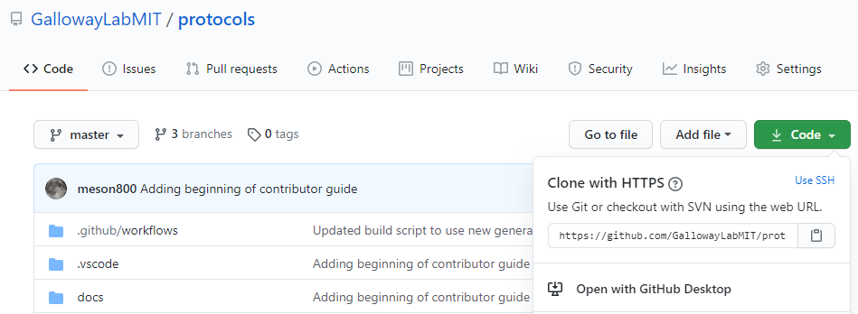
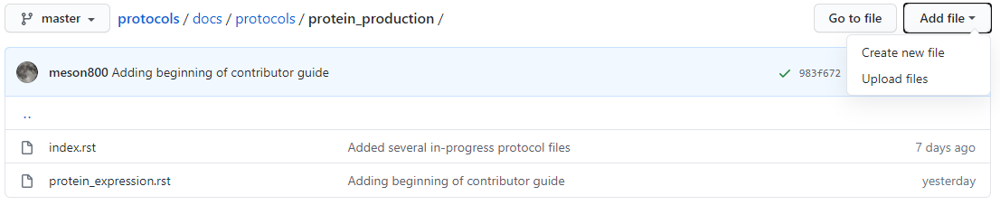
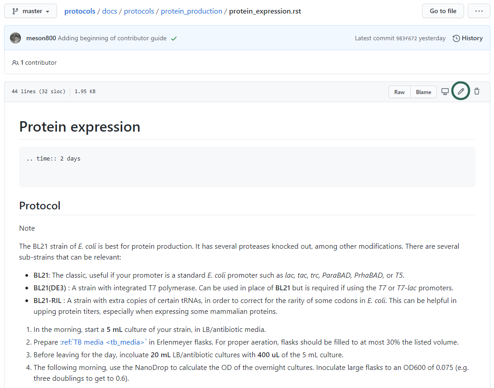
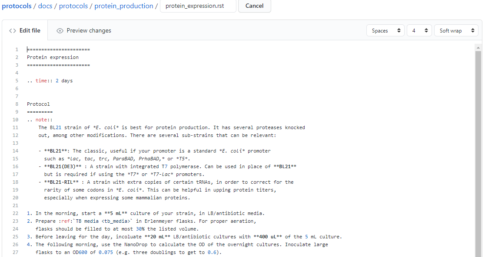
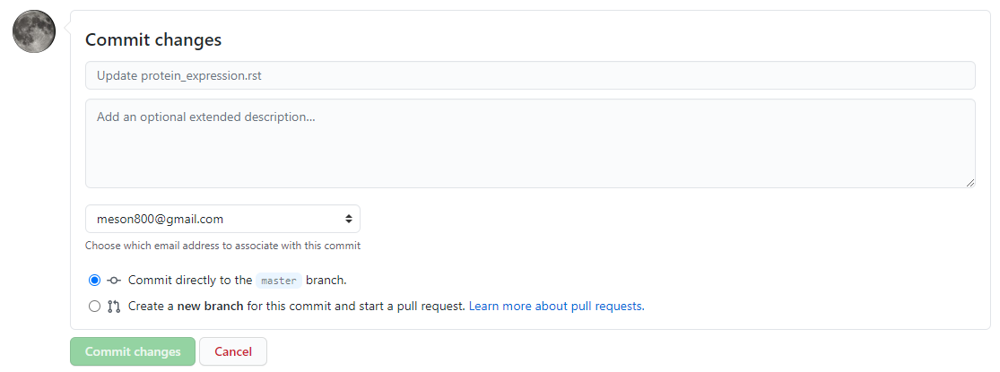

Contributor guide
=================

Protocols and recipes are written in reStructuredText, a lightweight markup
language that allows us to use plain text to describe relatively complicated intent,
letting us make tables, cross-links between different files, image inclusion, and so on.

The Python package Sphinx is used to automatically take this information and make a `searchable
website <https://gallowaylabmit.github.io/protocols>`_, in addition to a printable
PDF version of all of the protocols and recipes,
available `here <https://gallowaylabmit.github.io/protocols/galloway_lab_protocols.pdf>`_.

If you want to make small edits or prefer the browser interface, you can skip all
local setup and go directly to :ref:`contrib_online_edit`.

If you already are familiar with text editors and have an editing/programming environment
already setup, you can go directly to :ref:`contrib_local_build`.

.. _contrib_environ_setup:

Local environment setup
-----------------------
To locally build the protocols documentation, you will need to have a text editor of your choice
and a local install of Python. To contribute your changes, you will need access to **git** as well.

Text editor
~~~~~~~~~~~
Unlike a what-you-see-is-what-you-get (WYSIWYG) editor like Word, a *(plain)* text editor is used
for editing markup and programming languages.

.. note::
    Integrated development environments (IDEs) such as MATLAB, RStudio, TeXStudio, and others
    typically have a text editor integrated with debugging and other tools. These are helpful,
    but are often single-purpose. Having a text editor customized to your liking is especially
    helpful when switching between many languages or if extra customization is desired.

There are many options available:

- **Built-in editors**: Every major OS comes pre-installed with a plain text editor. Windows has
  *notepad*, Mac OSX has *TextEdit* (while this defaults to a rich-text editor, it can also be
  used as a plain-text editor), and most Linux distros have *vi* or *GEdit*.
- **Terminal-based editors**: *nano* is a basic editor, whereas *vim* and *emacs* are extraordinarily
  customizable.
- **Standalone editors**: These editors can be customized to be nearly IDE-like. On Windows, there is
  the venerable `Notepad++ <https://notepad-plus-plus.org/>`_. More recently, there are the commonly used
  editors `Sublime Text <https://www.sublimetext.com/>`_, `Atom <https://atom.io/>`_, and `VS Code <https://code.visualstudio.com/>`_.

Choice of editor is largely a personal preference. If you are doing limited plain-text editing, the built-in editors
may be sufficient. Becoming familiar with one of the terminal-based editors is useful when working on remote
compute clusters and servers.

If you are looking for a recommendation, VS Code is an excellent, relatively lightweight text editor with plenty
of helpful extensions.

.. tip::
    Using a modern text editor is very helpful when working with markup languages such as
    reStructuredText, Markdown, and LaTeX, as they often have support for live document preview,
    intelligent spell-check (ignoring programming terms as mis-spelled), and git support (no need
    to use the git command line or GUI app).

    As an example, this document was written in VSCode, with the Python and reStructuredText extensions
    installed:

    .. image:: img/vs_code.png
        :width: 90%
        :align: center

git
~~~
We use ``git`` to manage version history, simultaneous editing, and other features. There are `several <https://git-scm.com/book/en/v2>`_
`excellent <https://try.github.io/>`_ `tutorials <https://gitimmersion.com/>`_ elsewhere that explain how to use ``git``.

If you don't have ``git``, you can `install it from here <https://git-scm.com/downloads>`_, and install a GUI tool if you wish (such as the
standalone `Github Desktop <https://desktop.github.com/>`_, or using one built-in to your text editor).

Once you have ``git`` installed, you should *clone* the protocols repository. For any Github repository, you can find the clone
URL by clicking the green "code" button:

In the case of this repository, the HTTPS clone URL is https://github.com/GallowayLabMIT/protocols.git.

If you access Github using ``ssh`` keys, the SSH clone URL is
`git@github.com:GallowayLabMIT/protocols.git <git@github.com:GallowayLabMIT/protocols.git>`_.

The published version of the website uses the default ``latest`` branch, so push to this branch to update the website.

.. _python_setup:

Python/Sphinx setup
~~~~~~~~~~~~~~~~~~~
`Sphinx <https://www.sphinx-doc.org/en/master/>`_ is used to create the rendered website and PDF. Sphinx relies on
a Python version at least as new as Python 3.5.

If you do not already have a working Python version >= 3.5, use the `standard Python installer <https://www.python.org/>`_.
Anaconda can also be used, but generally the standard Python installer is preferred.

For standardization purposes, the Python packages required to build the website is specified in a ``requirements.txt`` file.
This means that we can use a **virtual environment** to reproducibly build the website.

To start, we need to make a virtual environment. We can do this using the ``venv`` Python module. The last argument is the name
of the virtual environment: here we give it the customary name ``env`` but you can choose anything. From the root of the repository
(e.g. the folder containing ``README.md``) create the environment. This only needs to be performed once! If weird package
errors happen later, we can always just delete the ``env`` folder and recreate it.

.. code-block:: console

  $ python -m venv env  # On Windows, most Linuxes
  $ python3 -m venv env # On modern MacOS

We now need to **activate** the environment. The syntax is slightly different between Powershell (on Windows) and bash/zsh (Linux, MacOS).
This typically has to be done every time you open a new terminal or when you switch between projects with different virtual environments.

.. code-block:: console
  :class: bash-console

  $ source env/bin/activate # On MacOS, Linux

.. code-block:: console
  :class: powershell-console

  > .\env\Scripts\activate # On Windows

Now that the environment has been activated, any Python changes we do (installing packages, etc) will only affect this environment.
We install all of the necessary build requirements by doing:

.. code-block:: console

  $ pip install -r requirements.txt

From now on, you just need to follow the virtual environment activation step.

Standard workflow
-----------------
A normal workflow to update a protocol would be:

1. Do a ``git pull`` to receive any updated changes from others.
2. Make changes to the desired files, such as adding pictures, writing new text, and so on.
3. Locally build the protocols website, checking for any errors (e.g. incorrect reStructuredText).
   Before running the local build, you will likely have to create/activate your virtual environment
   as listed in the :ref:`Python setup <python_setup>` section.
4. When there are no build errors, add the files and create a commit describing your changes.
5. Do a ``git push`` to update the website.

.. admonition:: Common problems

  - **The website isn't updating!**

    When you push your changes to Github, you start a remote build that
    does a full build of the project. This can take about two minutes.

    If the website still hasn't updated after two minutes, there is likely a
    (fatal) build error. Check to make sure that there are no errors printed when
    you locally build the website! You can also check the remote build log through
    `Github actions <https://github.com/GallowayLabMIT/protocols/actions>`_.

    If there are no errors or warnings while building locally but the remote build
    still fails, something strange is happening.

  - **I got a push rejected error!**

    If you run ``git push`` and get an error like:

    .. code-block:: console

      $ git push
      Pushing to https://github.com/GallowayLabMIT/protocols.git
        ! [rejected]        latest -> latest (non-fast-forward)
      error: failed to push some refs to 'https://github.com/GallowayLabMIT/protocols.git'
      hint: Updates were rejected because the tip of your current branch is behind
      hint: its remote counterpart. Merge the remote changes (e.g. 'git pull')
      hint: before pushing again.
      hint: See the 'Note about fast-forwards' in 'git push --help' for details.

    this means that someone else pushed changes to the same branch while you were making
    edits. This is not a problem, git is just warning you that you first need to merge their changes first.
    As suggested by the hint, the solution is often to do ``git pull`` again, which will
    download the remote changes and attempt to auto-merge them. If there are no errors shown
    when you run ``git pull``, the merge happened automatically and you can re-push.

  - **I got a merge conflict!**

    If another person has edited the **same part** of a protocol file at the
    same time you edited, you
    may get a merge conflict when you try to pull in the remote changes.
    This looks like this:

    .. code-block:: console

      $ git pull
      From https://github.com/GallowayLabMIT/protocols.git
      * branch            latest -> latest
      Auto-merging contributor_guide.rst
      CONFLICT (content): Merge conflict in contributor_guide.rst
      Automatic merge failed; fix conflicts and then commit the result.

    This error means that ``git`` isn't sure how to merge two sets of
    changes together. Instead, it needs the user to choose. For every
    conflicting file, search for the *conflict markers* marked with ``<<<<<<<`` and ``>>>>>>>``
    symbols, and decide how to combine the two versions. This probably involves
    talking with the other person who edited the protocol! An example merge conflict is:

    .. code-block::

      Text before the merge conflict.

      <<<<<<<HEAD
      The conflict region! Up here is
      your version of the files.
      =======
      Below the equal signs is whatever the remote version
      of this part of the file is.
      >>>>>>>a21ca24 (the git commit identifier)

      Text after the merge conflict

    It's up to you to decide how to combine the two versions of the file. When you are done editing
    (making sure to remove the conflict markers!), you need to ``git add`` the file
    to mark that you resolved the merge conflict, then ``git commit`` when you
    are done handling merge conflicts. You are then ready to ``git push``!

.. _contrib_local_build:

Local building
--------------
The documentation can be built by calling the ``build.py`` script at the base of this repository.
Normally, this means opening a terminal window, navigating to the repository, and calling:

::

  python build.py

This will attempt to build both the website only. If you have a local LaTeX install,
then you can build the PDF locally with:

::

  python build.py --latex

These build functions build the website in the folder ``output/html``. If you want to
view your locally built website, open the file ``output/html/index.html``.

Local previewing
~~~~~~~~~~~~~~~~
If using VS Code with the reStructuredText plugin installed, you can use the instant previewer to view
the HTML version as it recompiles on the fly. To show the preview, open the Command palette,
accessible through  ``Control-Shift-P`` or ``Command-Shift-P``, and run ``reStructuredText: Open Preview to the Side``.

If local previewing fails, you need to check a few things:

1. Make sure that the reStructuredText language server is installed in your
   virtual environment. Run ``pip install -U esbonio``.
2. Make sure that VSCode is using your virtual environment. To check, open the command
   palette and go to ``Python: Select Interpreter`` and make sure that the virtual
   environment Python is selected.
3. Make sure the reStructuredText plugin is using Sphinx, not docutils. On the left side of the
   statusbar, you should see ``Sphinx: protocols/docs/conf.py``. If you see ``Use docutils``, click
   the label and switch to using Sphinx.
4. If you run into ``esbonio`` startup errors, check for the existence of a ``.vscode/settings.json``
   file. If any lines are marked with errors (yellow underline), delete them.

In case of build errors
~~~~~~~~~~~~~~~~~~~~~~~

In the case of strange build errors that seem to be because the output directory has been
corrupted, you can close any program that might be using the output (a common one might
be Adobe Acrobat, with the generated PDF open) and run:

::

  python build.by --force-rebuild

Adding this flag deletes the ``output`` folder and recreates it. You can also do this manually
to recreate "rebuild" behavior.

.. _contrib_online_edit:

Online editing through Github
-----------------------------
When editing directly through the Github website, you won't be able to check for Sphinx build
errors or fully preview the generated PDF and website until you commit to the branch. For this reason,
doing :ref:`local builds <contrib_local_build>` is preferred.

To create a new file directly through Github, navigate to the folder you want to add the file, and
click the **Add file** dropdown on the right:

To edit through Github, navigate to the file you want to edit, then click the pencil in the upper right
of the file view:

.. note::
  While Github does render a preview of what the reStructuredText will look like,
  it does not preview how Sphinx will render the final website. For example, we can see in the
  above image that the Github preview does not show the custom ``time`` directive, and it
  does not show the proper link destination for the cross-referenced recipe.

  In general,
  the Github preview will give you a good idea of what tables/lists/other text will appear,
  but it will not properly render all Sphinx-enabled markup.

This will open an editor window:

After you are done editing, add a commit message describing your change, and (normally), commit
directly to the ``latest`` branch. If there is need for further discussion of an added protcol,
creating a secondary branch + pull request could be helpful.

.. note::
  Make sure you make the commit message more descriptive than the default "Update <filename>" message!

.. _contrib_repo_layout:

Repository layout
------------------
All of the relevant documentation files to edit are stored in the ``docs`` folder.

Each subdirectory is included as its own sub-level in the table of contents. This
hierarchy is derived from the ``index.rst`` that is in each folder. Generally, each
of these ``index.rst`` files have the following content; if you create a new
subdirectory you should generally add this as the ``index.rst`` file:

::

  ============
  Section name
  ============

  .. toctree::
    :maxdepth: 2
    :glob:

    */index
    *

Here, ``glob`` means that the ``*`` is expanded as a wildcard. The first wildcard search,
``*/index`` means "include all subdirectories beneath this directory". The
second wildcard search ``*`` means "include all other ``.rst`` files in this directory.

The current subdirectory layout looks like:

::

  docs
  ├─protocols
  │ ├─analytics
  │ ├─cloning
  │ ├─protein_production
  │ └─tc
  └─recipes
    ├─bacteria
    └─tc

The ``.github`` folder contains the continuous integration script responsible for
updating the website on every push.

.. _contrib_rst_basics:

Basics of reStructuredText
--------------------------

reStructuredText (RST) is a *lightweight* markup language. This means that it is not
as cumbersome as languages like HTML and LaTeX, but still has enough power to make
nice looking documents.

There is an `excellent RST primer and reference here <https://www.sphinx-doc.org/en/master/usage/restructuredtext/basics.html>`_
which should be your primary reference, but here we will cover some of the basics.

One nice feature of the generated website is the ability to view the page source for each page.
If there is a protocol that uses some RST feature that you want to replicate, on the desktop version of the website (e.g. not mobile),
you can click the "View page source" button in the upper right of **any page** on the website to see the RST code that
generated that page. That includes this page, so check out this page's source to see how this guide was written!

.. note::
  There are several whitespace-dependent features of RST. This means that you should configure
  your text editor to insert spaces instead of tabs when you hit the tab button (this is also true
  if you are programming in whitespace-dependent languages like Python).

  Without wading too deeply into the
  `holy war <https://softwareengineering.stackexchange.com/questions/57/tabs-versus-spaces-what-is-the-proper-indentation-character-for-everything-in-e>`_,
  tabs vs spaces **does not mean the difference between pressing the space bar vs hitting tab for indentation**, it refers
  to what character actually gets inserted into the document when you press the tab button.

  Long story short, if your text editor inserts literal tab characters,
  there is possible inconsistency between tools and editors; some may display a single tab character as the width of two spaces, some as
  the width of four spaces, and so on. This causes problems. If you set your editor to insert spaces, you still hit tab, but the editor
  inserts some fixed number of spaces, typically four.

  This setting will depend per editor. In VS code for example, you don't have to do anything; it defaults to inserting spaces, but
  the option looks like this:

  .. image:: img/tabs_vs_spaces.png
    :width: 100%
    :align: center

Simple markup
~~~~~~~~~~~~~

You can add headers by surrounding the header with equal signs, hyphens, tildes, and other special characters.

.. admonition:: Example

  ::

    Section header
    ==============

    Subsection header
    -----------------

Use single asterisks to italicize text. Use double asterisks to bold text. Wrapping double backticks around text renders it in monospace.

.. admonition:: Example

  ::

    *italics* and **bold** and ``monospaced``.

  renders as

  *italics* and **bold** and ``monospaced``.

You can make bullet lists by starting lines with ``*`` or ``#``, and you can make numbered lists by starting lines with ``1.``, ``2.``, etc.

If you are nesting lists, you must surround nesting levels with blank lines.

.. admonition:: Example

  ::

    * Lab activities

      * Axe throwing
      * Pizza party
      * ?????

    * Lab meme sources

      * p53
      * Cloning, so much cloning

    1. Testing
    2. a
    3. numbered
    4. list

  renders as

  * Lab activities

    * Axe throwing
    * Pizza party
    * Other?

  * Lab meme sources

    * p53
    * Cloning, so much cloning

  1. Testing
  2. a
  3. numbered
  4. list

Explicit markup
~~~~~~~~~~~~~~~

In RST, an "explicit" block is any block that starts with ``..``. Explicit blocks must be surrounded
on both sides by blank lines, like nested lists. This means that explicit blocks like:

::

  Do the foo, then the bar
  .. note::

    Make sure you don't do the bar, then the foo!

will not render correctly, it must be written:

::

  Do the foo, then the bar

  .. note::

    Make sure you don't do the bar, then the foo!

Admonitions
~~~~~~~~~~~

To call-out a specific part of a protocol, you can use one of the various admonitions.

This project includes the special time estimation admonition, which demonstrates the general principle. Writing:

::

  .. time::

    2 hours

renders as

.. time::

  2 hours

Other directives (code blocks, tables, images, etc) can be fully nested inside these blocks.

Other options commonly used here are ``hint``, ``important``, ``note``, ``tip``, ``deprecated``, and ``warning``, which render as

.. hint::

  Test

.. important::

  Test

.. note::

  Test

.. tip::

  Test

.. deprecated:: 2021.11.24

   Test

.. warning::

  Test

Code
~~~~

To insert a codeblock, start an empty line with ``::``, followed by an indented block that will be rendered as code.

.. admonition:: Example

  The above code example of the time estimation admonition was written as:

  ::

    ::

      .. time::

        2 hours

Tables
~~~~~~

See the `table documentation <https://www.sphinx-doc.org/en/master/usage/restructuredtext/basics.html#tables>`_ for more details,
but in brief, most of the time you can use the "simple" table layout.

In the simple table layout, you simply surround the desired table text with equal signs to set off different columns.

.. admonition:: Example

  ::

    ================= ===========================
    Ingredient         Amount per 1L final volume
    ================= ===========================
    Tryptone 			12 g
    Yeast extract		24 g
    Glycerol			4 mL
    Deionized water		900 mL
    ================= ===========================

  renders as

  ================= ===========================
  Ingredient         Amount per 1L final volume
  ================= ===========================
  Tryptone 			12 g
  Yeast extract		24 g
  Glycerol			4 mL
  Deionized water		900 mL
  ================= ===========================

References and links
~~~~~~~~~~~~~~~~~~~~~

To reference a standalone hyperlink, you can just simply write it directly in the rst file, no special markup required.

If you want to add link text, use the following syntax:

.. admonition:: Example

  ::

    https://example.org or `Link text <https://example.org>`_

  renders as:

  https://example.org or `Link text <https://example.org>`_

If you want to specifically link to other protocols/recipes files, you use the special `doc` syntax:

.. admonition:: Example

  ::

    :doc:`This <contributor_guide>` is a link to this very document!

  renders as:

  :doc:`This <contributor_guide>` is a link to this very document!

as you can see, this is very similar to the external hyperlink, except it has the special ``:doc:`` before it, which tells Sphinx
that the document is included in this repository.

If you want to reference a specific subsection of a document, you can set a label and set a reference to it. This is best explained by the
`documentation <https://www.sphinx-doc.org/en/master/usage/restructuredtext/roles.html#ref-role>`_, noting that labels that you create are
global and shared across the entire repository!

Images
~~~~~~

To include an image, you can specify it as follows. Typically, you want to align center
and make the image fill the available horizontal space, so a common image call would be:

::

  .. image:: image_location/image_filename.png
    :width: 100%
    :align: center

Math
~~~~

You can write arbitrary LaTeX-formatted math by using the math directive. The math must be
separated from the directive by a blank line, followed by an indented math block.

.. admonition:: Example

  ::

    .. math::

        E = mc^2

  renders as

  .. math::

      E = mc^2
