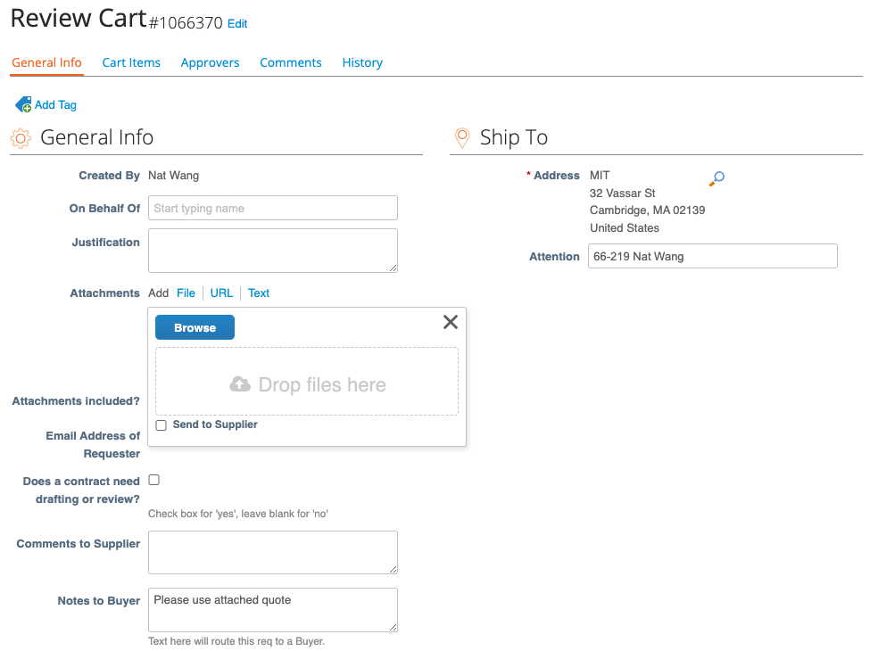
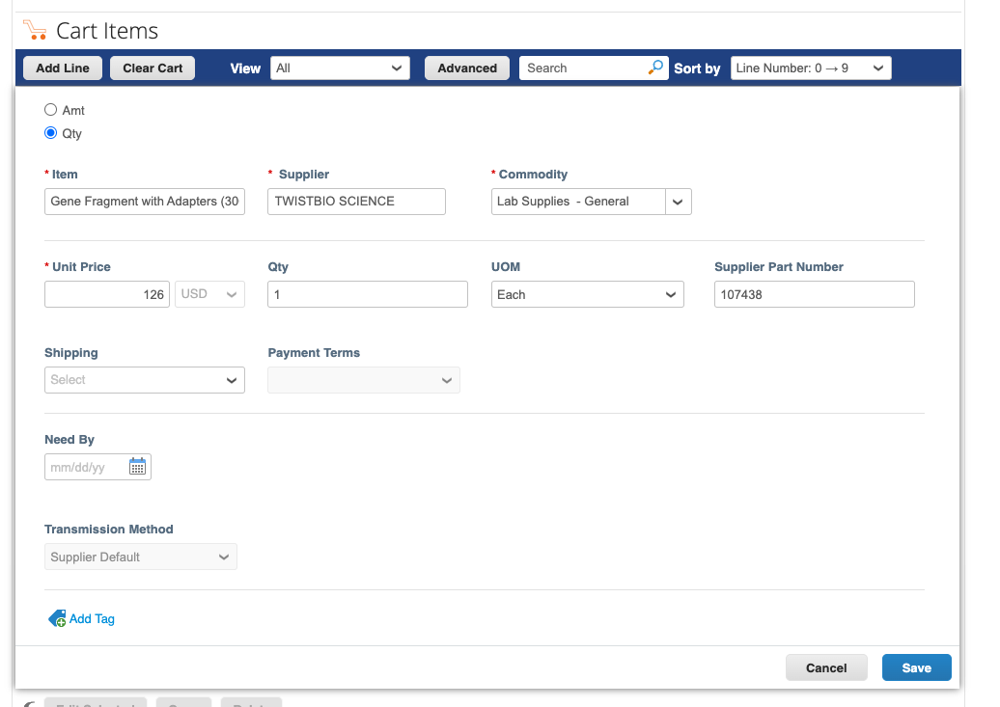

====================================
Ordering
====================================

.. important::
    Check with Katie which cost object to use if unsure. Too many changes can trigger an audit unnecessarily. 

There are several ways to order/request new lab reagents. For all lab reagents, materials, etc., be sure to enter the information in Quartzy so that inventory can be tracked.
(This excludes oligos, Addgene plasmids, and most Amazon items for the office.)
See the :doc:`receiving instructions </general/receiving>` for proper tracking and storage of delivered items.

Direct ordering through Coupa
-----------------------------

MIT's ordering system is accessible at https://mit.coupahost.com. After logging in, there is a large list of suppliers
on the right that are available for "punchout", i.e. you can just add to cart and checkout inside Coupa.

On the Coupa checkout screen, fill out the following information:

- **Address**: Under the \'Ship To\' tab, click the magnifying glass. Search for Building 66 by typing \'66\' and select the standard delivery option. This is 32 Vassar St, the main receiving area for MIT deliveries.

    .. image:: ../img/ordering-address.png

- In the \'Attention\' box, add lab address and your name, i.e., \'66-219 – Your Name\'.

   .. important::
        Be sure to write the lab address first! Occasionally, Amazon deliveries will truncate this field.

.. figure:: /img/ordering-review-cart.png
    :align: center
    :figwidth: 85%

- **Billing**: For each item, choose the correct item type (e.g., General Lab Supplies) and click the magnifying glass to choose the PO to charge.

    .. image:: ../img/ordering-account-1.png

- The PO can be found by searching \'Galloway\' and selecting an option from the list (e.g., \'Start-Up Funds\').

    .. image:: ../img/ordering-account-2.png

- Double check that the Approver workflow is accurate (i.e., through ChemE) and submit the order.

    .. image:: ../img/ordering-approvers.png

After placing the order through Coupa, be sure to add the items to Quartzy (see below). This helps organize the lab inventory and facilitates re-ordering.

Attaching a quote to a Coupa order
----------------------------------

1. Navigate to the cart
2. Click ``Add file`` under Attachments
3. Drag the quote there
4. Add a buyer note to ``Notes to buyer``: "Please use attached quote"

1. Manually add the item into the cart. Scroll down, click ``Add line``, put in the info for your item and save

    

Requests through Quartzy
------------------------

There are three scenarios for adding requests to Quartzy: re-ordering an item in the inventory, making a new request for an item to be ordered, and adding an item already ordered through Coupa.

.. tip::
    To check the current item price, search for the item from the relevant supplier in Coupa. Be sure to log in to see the discounted MIT prices!

**Re-Ordering**

To request an item already in the inventory, select the item and click on the \'Request\' button. Double check that the catalog number, price, and quantity are correct, then click \'Request\' to submit the request for Tseganesh to order.

    .. image:: ../img/ordering-reordering.png

**New Requests**

To request a new item, select the \'Requests\' tab and click the \'Request\' button in the top left corner of the page. Search for the item by Manufacturer and Catalog Number, and enter the correct price and quantity.
There are two suppliers to choose from: the \'Quartzy Shop\', in which Quartzy fulfills the order (can be cheaper but may experience delays), or the manufacturer directly. Then click \'Request\' to submit the request for Tseganesh to order.

    .. image:: ../img/ordering-new.png

**Adding Ordered Items**

To add an item ordered directly through Coupa, follow the same process as for a new request. The item will appear in the \'New\' section under the \'Requests\' tab. Then, select the \'Mark Ordered\' button to move the item to the \'Ordered\' tab.

    .. image:: ../img/ordering-add-item.png

Bulk Plastics Order
-------------------

The following items are ordered in bulk biannually from Genesee Scientific:

- Serological pipettes
- Cell culture plates, flasks, and dishes
- Syringe filters
- Barrier tips and reach tip reloads
- Reagent reservoirs
- Tubes (0.6ml 1.7ml, 15ml, 50ml, cyrovials, culture, PCR)
- Gloves

Information for the bulk order can be found in the ``lab_jobs`` folder in the Sharepoint.
To coordinate a bulk order:

1. Collect the tally sheets from lab, which are located in three places: 66-219, rack next to the liquid nitrogen tanks, and rack across from the wooden wall shelves near the entrance to main TC. Replace the tally sheets and update the dates.
2. Calculate the number of units needed for each item based on usage (from the tally sheets), any extra items ordered on Quartzy, and the previous order.
3. Input this information into a new spreadsheet with the prices from the previous bulk order. Prices tend to increase annually, but this will be a good starting point.
4. Directly email this spreadsheet to the Genesee Scientific representative (Brad Sloan, as of 2023) and request a quote; copy Tseganesh on this email so she can arrange the PO(s).
5. Once the order is placed, print the order spreadsheet and post it on the door to the atrium to track the plastics as they are delivered. Be sure to inform the lab so they can help track items.