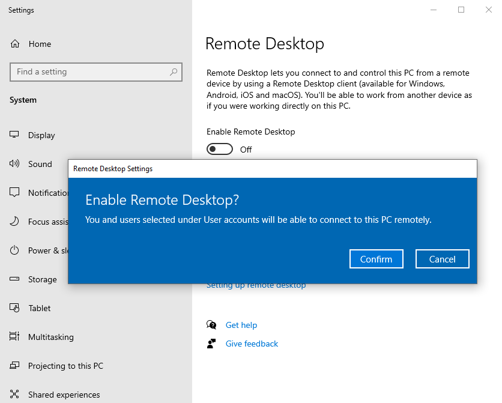
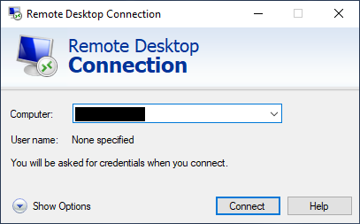
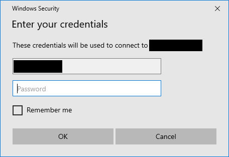
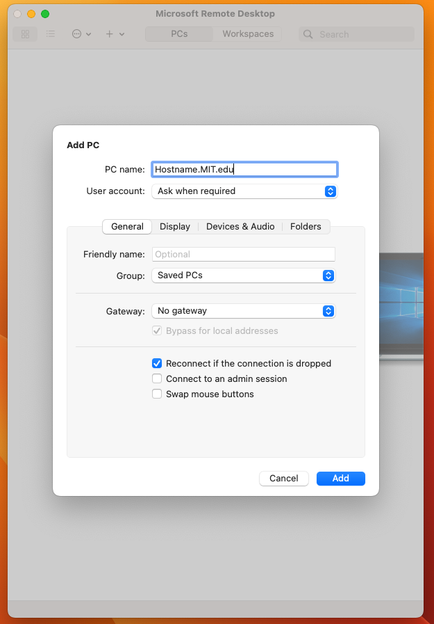
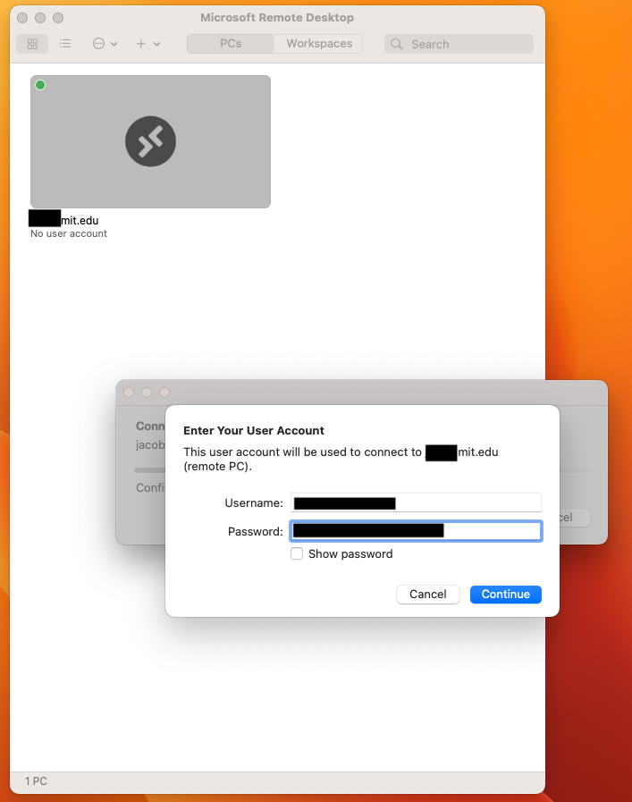

=================================
Remote desktop for lab computers
=================================

It is sometimes convenient to be able to remote into lab computers,
such as as when a microscope computer is running a timelapse.

At the same time, it is **not recommended** to use software such as
TeamViewer to enable remote access. In addition to being a company
with a bad security record, TeamViewer and similar software open you up to the entire internet.

The better solution is to use the Remote Desktop Protocol (RDP) built into Windows,
and use the MIT VPN if you are off-campus to keep access to the computers secure.

Enabling remote desktop
=======================
.. important:: 
    Only keep the remote desktop setting active while you are expecting to use it.
    When you are done, turn it off.

1. Hit the Windows key or click the start menu search. Search for "Remote desktop settings".
2. Enable remote desktop by clicking on the switch. It will pop up a modal to confirm this action.

3. Verify that the default setting "Keep my PC awake for connections when it is plugged in" is set.
4. Setup your timelapse, etc. At this point, the computer is accessible if you are either
   on the MIT network or using the VPN (if off-campus), but from nowhere else on the internet.
5. Check the note card on the physical computer for server name / username / password information.
6. When done, go back to "Remote desktop settings" and disable the switch.

Remoting in to lab computers
============================
Instructions vary from operating system to operating system.

Windows
~~~~~~~
1. If you are not plugged in over Ethernet at MIT / using MIT Secure, connect to the MIT VPN.
2. Hit the Windows key or click the start menu search. Search for "Remote desktop connection".
3. Enter the full computer domain name (from the notecard on the computer) into the box.

4. When prompted for credentials, use the username and password from the notecard.

5. If there is a certificate warning, you can accept it because we are connected through MIT's network.

.. note::

    .. image:: ../img/rdp_cert_warning.png
        :width: 50%
        :align: center

    The certificate warning comes from the fact that we are using full domain names, but the computers
    aren't publicly accessible at that domain name, so can't get something like a Lets Encrypt certificate.  

MacOS
~~~~~
1. Go to the App Store and download "Microsoft Remote Desktop" app.
2. If you are not plugged in over Ethernet at MIT / using MIT Secure, connect to the MIT VPN.
3. Hit the plus sign and "Add a PC", and enter the full host name / domain name from the notecard:

4. Double click the connection tile to connect. When prompted for credentials, use the username and password from the notecard.

5. If there is a certificate warning, you can accept it because we are connected through MIT's network.
6. Hit ``command-q`` to exit the remote desktop connection when done.

Linux
~~~~~
FreeRDP works great; look up from your distro instructions how to install the client this (``apt install xfreerdp``)

The command you want to run is

.. code-block:: console

    $ xfreerdp /u:"USERNAME" /v:HOSTNAME.mit.edu
