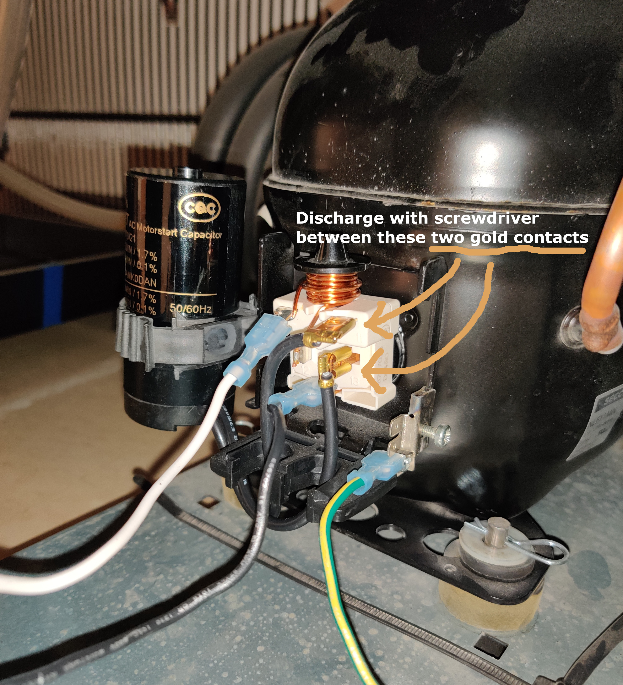
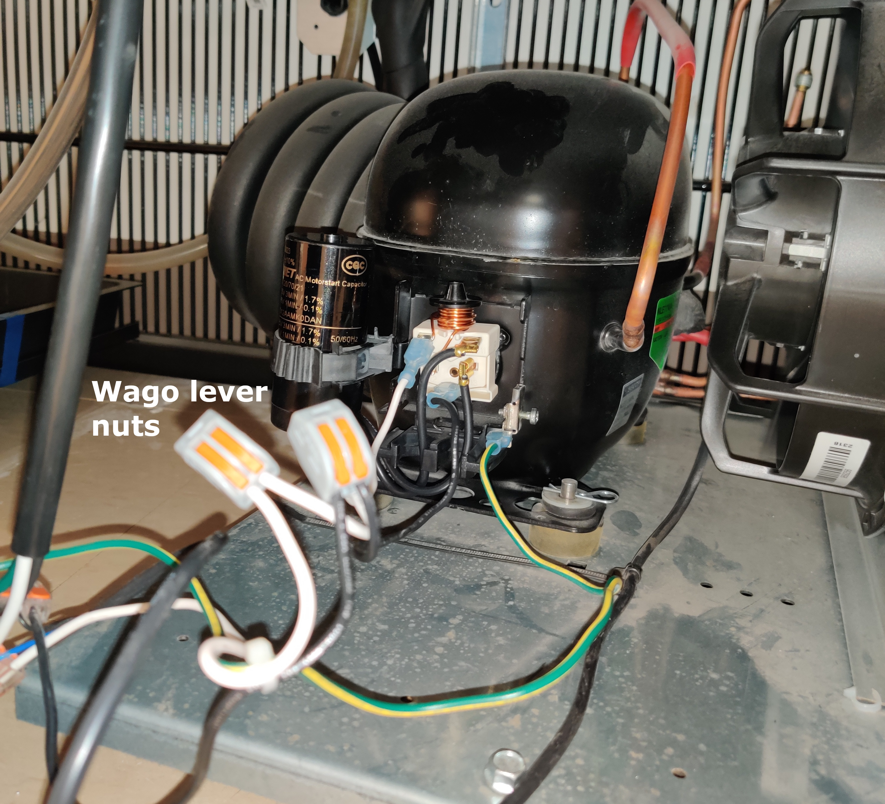
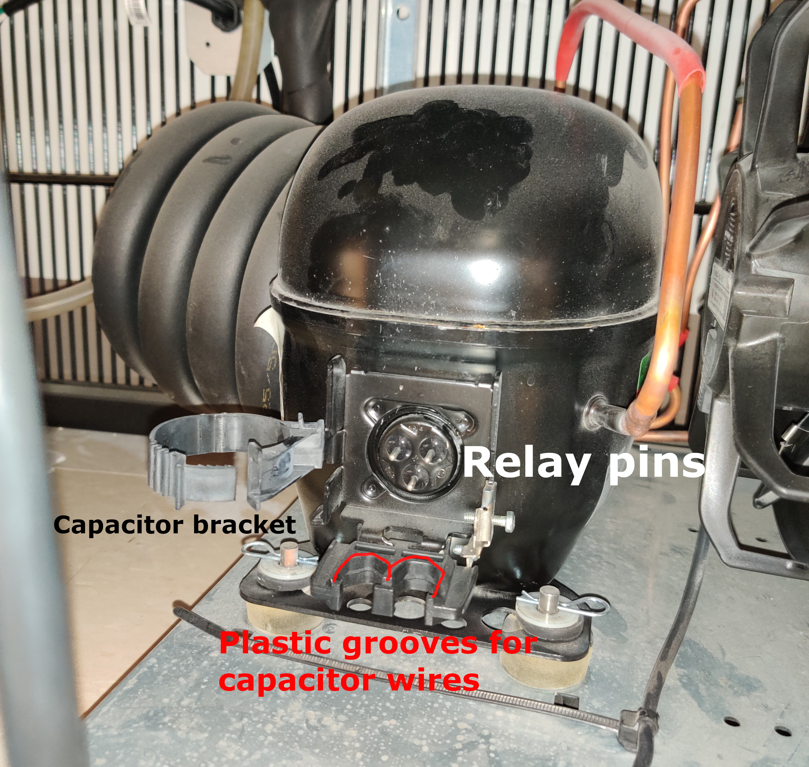
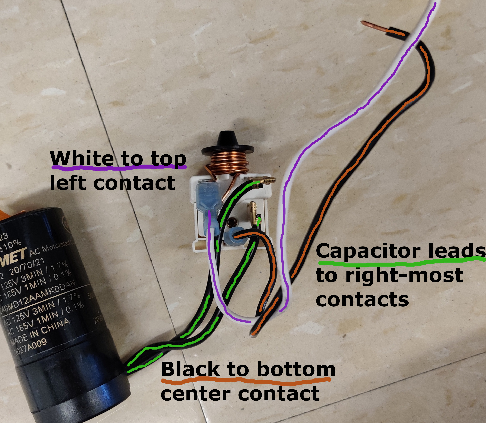
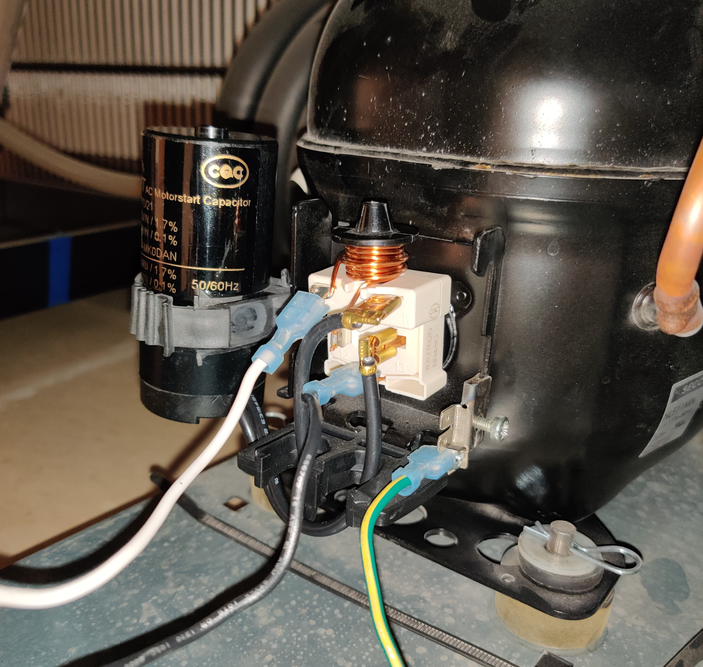

Deli fridge starter replacement
================================

When the deli fridge refuses to start, it is possibly due to the starter components. The starter components are responsible for getting the initial burst of energy needed to turn over the compressor motor. Luckily, both of these parts are easy to replace!

Background
==========
The starter consists of two parts:

1. A current-sensitive starter relay: `this video <https://www.youtube.com/watch?v=PRq1WPH1sRg>`__ discusses the details, but this is effectively a relay that turns on when it senses current above a certain threshold, entirely mechanically.
2. A starter capacitor: this is an extra energy store that the starter relay switches on, and provides enough energy to turn on the compressor.

We can reorder the parts for relatively cheap:

- A `Danfoss/Kemet 117U5023 240V capacitor <https://www.zoro.com/danfoss-capac-240-mfd-125v-round-wbkt-117u5023/i/G4044761/>`__, $23.49 from Zoro. The capacitor fails by not having the correct capacitance anymore (e.g. through dielectric breakdown or other effects).
- An additional capacitor that is available to try is the `Dayton E224674 Motor Start Capacitor, 216-259 MFD, Round <https://www.zoro.com/dayton-motor-start-capacitor-216-259-mfd-round-2met8/i/G2244356/#specifications>`__, $24.39 from Zoro. This is a larger capacitor than the previous and could be used as an additional replacement. Lead wires are not attached to this capacitor and must be done so separately.
- Lead wires for the above capacitor, `Dayton Capacitor Jumper Wire Set <https://www.zoro.com/dayton-capacitor-jumper-wire-set-6-in-pk10-2mev9/i/G2684324/>`__, $18.65 from Zoro.
- A `Danfoss 117U7020 current-starting relay <https://www.zoro.com/beverage-air-relay-danfoss-117u7020-for-312155d-comp-314-075d/i/G806895395/>`__, $36.19 from Zoro. The relay fails when the contacts begin getting pitted / arcing and either the resistance is too high or it does not properly switch.

Disassembly
===========

1. Unplug the deli fridge from the wall. Wait about 5 minutes for capacitors to discharge.
2. Take the front grill off. It just pops off if you pull it horizontally out.
3. Using a **plastic-handled screwdriver, holding on using only the plastic** and after **ensuring the power is off**, fully discharge the capacitor by using the metal part of the screwdriver to briefly connect the two capacitor leads. There might be a spark or popping noise; this should be fine.

    Lightly touch a metal screwdriver between these contacts while only touching the plastic part of the screwdriver.

4. Loosen the capacitor from the plastic bracket. This plastic piece acts like a ski/snowboarding binding; you can lift up on the end to release it.
5. Find the two, two-input Wago lever nuts that connect to the relay. One should be connecting a pair of white wires, and one should be connecting a pair of black wires. Open the lever and remove the wires that lead to the relay.

.. note:: 

    The starter relay and capacitor are wired into the rest of the system using something called
    `Wago lever nuts <https://www.youtube.com/watch?v=n8gLG6c-iKc>`__. 

    .. image:: ../img/wago-lever-nuts.jpg
        :width: 50%
        :align: center

    A spring is compressed when you open the levers. You should be able to open the levers until they
    are perpendicular to the incoming wires.

    The lever nuts are in the foreground, in their engaged position. You only need to lift the lever on the one wire we are removing for each lever nut.

4. Pull the relay off of the motor, taking the capacitor with it. There are three pins that go into the back of the relay, so you just pull out horizontally.

    The motor after removing the starter components.

        
Debugging
==========
You don't need to disconnect any wires between the capacitor and relay to test it.

1. Check if the relay is bad or not. The relay switches via a metal piece that gets pulled up into the
   electromagnet. There is no spring, so testing this is as easy as inverting the relay. Attaching a multimeter in resistance mode, it should be an open circuit when the relay is right-side-up and a low resistance around 1 ohm when it is inverted.

.. note::

    The following shows a successful test of a relay. In the up position, the contacts are not connected (OL means an open connection). In the upside down position, the resistance is low, under one ohm.

    .. image:: ../img/deli_starter_relay_up.jpg
        :width: 45%

    .. image:: ../img/deli_starter_relay_down.jpg
        :width: 41%

2. Optionally check if the capacitor is bad or not. This is more difficult to test unless you have a multimeter with a capacitance mode. The resistance over the capacitor leads should read around zero, but it will also likely read near zero if the capacitor is bad. 

If the relay resistance is fine and switches when you invert it, then try swapping the capacitor.  

Assembly
========
1. After deciding which part to replace (possibly both!) connect the replacement capacitor and relay by using the existing connectors. This should not require any wire stripping; just reuse the wires with the push-on connectors.  Assemble it as in the picture. It is **important which terminals you connect the white and black wires to**, but it does not matter which orientation you attach the capacitor (it's an AC capacitor so no polarity).

    The correct connections are shown.

2. After ensuring that the deli fridge is unplugged, take the capacitor/relay assembly and secure the capacitor by sliding it into the existing holder and latching it.
3. Align the three holes on the back of the relay and lightly push it onto the motor. Ensure that the copper/black plastic "hat" is pointing up. The wires leading to the capacitor route through the grooves in the plastic beneath.
4. Ensure that the green wire is plugged into the terminal to the lower right of the relay. This ensures that the metal of the deli fridge is safely grounded. 

    Properly reassembled starter components

5. Reattach the stripped ends of the white and black wires to the Wago lever nuts, **matching white to white and black to black**. Make sure all levers are in the down position and the wires are securely attached.

Replacements:
========
- 2023.11.10 - Capacitor
- 2024.06.24 - Capacitor