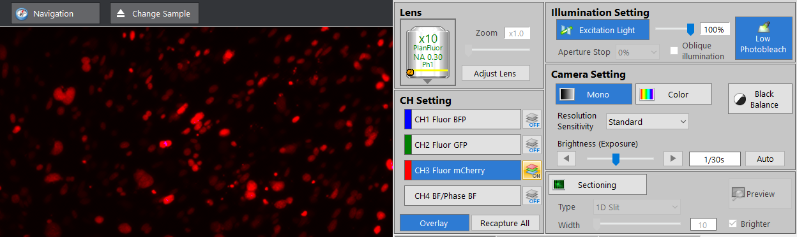
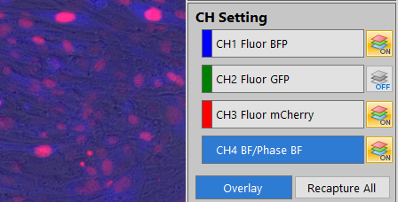

======================================
Keyence beginner's user guide
======================================

Basic Operation
---------------

1. Turn on the Keyence using the power button.
2. Open the BZ-X800 program from the desktop shortcut. You will see the following menu. Note: you must turn on the Keyence before you are able to navigate the software.

3. The **Filter Cube** button can be used to change which 4 filters are used when capturing images.

4. If you are using a plate, the **Well Plate Settings** button can be used to select the number of
   wells on your plate. This can also be changed within the capture window.
5. The most frequently used capture setting is **Capture Still Images**, and selecting this option leads to the window below:

6. **Focusing Images**: To manually focus the microscope image, use the mouse scroll for fine adjustments. For moderate adjustment use ctrl + mouse wheel. For large adjustments use ctrl + shift + mouse wheel. There is also an option to auto-focus under the Z Position menu, but this method can take longer.
7. **Exposure Time / Brightness**: To change the brightness of the selected channel, change the exposure time under the Camera Setting menu. In general, it is best to stay under an exposure time of 1s for fluorescent channels because any longer typically starts to show autofluorescence.

8. **Overexposure**: When the exposure time is too high, the images can be overexposed. When this happens, the image has purple spots in the areas that are overexposed. It is best to decrease exposure time until no more purple is seen.

9.  **Channel Settings**: Select which color channel to view by clicking on the buttons labeled CH1, CH2, CH3, or CH4.
    Only the selected channel will captured when changing X/Y/Z position or exposure times.
    Multiple channels can be viewed at once by clicking the ON/OFF button next to each channel.
    However, you must select each channel in turn to update the each channel's image to the current X/Y/Z position.

10.  **Navigation**: There are several options to navigate a plate. (1) Click and drag on the microscope image. (2) Use the arrows in the Stage View menu. (3) Click to the desired location in the plate layout in the Stage View menu. The red perpendicular lines indicate the current position.

.. image:: img/6-well_plate.PNG
  :width: 50%
  :align: center

11. The stage view menu can also be changed here to match the plate layout.

12. **Magnification**: To change the magnification, click on the objective lens button in the Lens menu on the left, and the objective lens options will appear. Select the desired magnification.

.. note::
    **The 60X lens requires adding oil to the lens.** See :ref:`60X Magnification <60X_mag>` 

Default image settings
-----------------------

.. important::
    Check to make sure the image settings are off. It is best practice to take un-edited images and then make trackable adjustments with softwares like Fiji.

Here are some common things to check for.

.. image:: img/image-settings.PNG
    :width: 100%
    :align: center

As an example, this is what the same cells look like with black balance on.
While it helps clarify which cells are mRuby2+, it can also be misleading.

.. image:: img/image-settings-blackbalance.PNG
    :width: 100%
    :align: center

.. _60X_mag:

60X Magnification
------------------

The 60X lens works best with glass coverslips/plates. 

.. important::
    The 60X lens is very sensitive. Exercise extreme caution when using and only clean with the special *Ross Optical Lens Tissue* (doesn't leave behind lint).
    
Tips for cleaning
~~~~~~~~~~~~~~~~~

1. Dust is the most common contaminant and can usually be removed using pressurized gas. Use a dust-free blower or a soft optical cleaning brush to remove large dirt particles before attempting to clean the optic with lens tissue, as these larger particles trapped under the tissue will scratch the surface.
2. Take a single piece of tissue and fold it in half until it is about 1 inch wide. **Moisten the tissue with ethanol**.
   The tissue should be moist but not dripping wet.
3. Place the moist portion of the tissue on the optic.
   With gentle pressure from your index finger, drag across the surface with a circular motion, starting from the center of the lens and moving outward.
   Discard this piece of tissue. Reusing the same tissue can cause recontamination of the cleaned surface.
4. Repeat steps 2 and 3 until the surface of the optic is clean.

How to use the 60X lens
~~~~~~~~~~~~~~~~~~~~~~~~
1. Click the "x60 lens" icon to change the lens 
2. Click ``Drop Immersion Oil...``. The 60X lens will move forward for you to be able drop oil on it.

 .. image:: img/immersion_oil.png
     :width: 75%
     :align: center

2. Follow the instructions that are presented.
   Use the Nikon immersion oil and carefully place no more than one drop of oil.
   Wipe off excess with a Ross optical tissue so oil doesn't spill when the plate is added.

    .. image:: img/immersion-oil-instruct.png
     :width: 75%
     :align: center

3. Click ``Ok`` and then proceed to change the lens.

.. note:: If doing lots of imaging, you may have to add more oil as it will dry out from the heat.

Multi-point capture
-------------------

1. To capture multiple X/Y/Z points on your plate, instead of capturing points individually,
   select the **Multi-Point** button under the Capture Area Settings menu.

2. Navigate to a position on the plate and focus the image. To set a capture point, click **Set**.
   This point will then be Registered as a capture point and assigned a number.
   Orange dots will appear on the Stage View for each set capture point.

3. Once all the capture points are set, turn ON all the color channels to capture and ensure the exposure settings for each channel are correct.
   Then click **Start Capture** at the bottom of the screen.
   A dialogue box will appear to select where you want the images to be saved (Root Path), name the folder the images will be grouped into (Group Folder),
   and whatever prefix you want to give the images such as the date or magnification.
   Click OK to capture images.

   .. note::
    Usually, you *do not* want the **Use Individual Setting** box to be selected when using Multi-Point Capture.
    This ensures that whichever channels are turned ON and the exposure times for those channels are the same for all the images captured.
    The same exposure settings between images is required for the direct comparison of brightness between conditions.
    
    If the **Individual Capture Setting** *is* selected, the Multi-Point Capture will record which channels are turned on and their exposure settings *when the point is originally set*.
    This can be useful if you want different exposure settings for some conditions or different wells require different color channels to be captured.
    However, *it is important to remember this each time you set a capture point*.

.. image:: img/multi-point_capture.PNG
  :width: 100%
  :align: center

Z-stack
-------

1. To capture multiple focal planes, click the **Z-stack** button under Capture Area Settings.
2. The default Z-stack method is to set the Upper and Lower Z coordinates.
   First, focus the image to the highest Z position to capture and click **Set** next to **Upper Limit**.
   Next, focus the image to the lowest Z position to capture and click **Set** next to **Lower Limit**.
   Finally, select the desired height between images (Pitch). If also using Multi-Point Capture, you may want to set these values for each capture point.

3. Alternatively, select the box next to **Fix Range**. Then set the Z position to be the center of the Z-stack by focusing the image and clicking **Set**.
   Enter a range to capture. For example, a range of 20um will capture 10um above and below the center, for a total range of 20um.
   Additionally set the desired height between images (Pitch).

Stitching
---------

1. To capture a larger total area at a given magnification, click the **Stitching** button under Capture Area Settings.
   This will capture a series of slightly overlapping images that cover the desired area.
   There is the option to **Set Center and Number of Images** or to **Set Edge Points**.
2. **Set Center and Number of Images**: When you set your capture point, this will be the center of the stitching region.
   Next, choose the size of the grid to capture. For example a 2x3 grid will capture an area 2 images wide and 3 images tall, 6 images in total.

3. **Set Edge Points**: Click set at the locations at the edge of the field you wish to capture. It will automatically determine the number of images to capture.

.. note:: The images will be saved separately. If the images need to be stitched together, this can be done using the BZ-X800 Analyzer software or using a custom script.