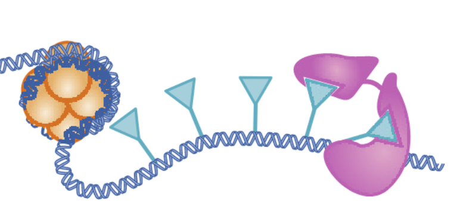
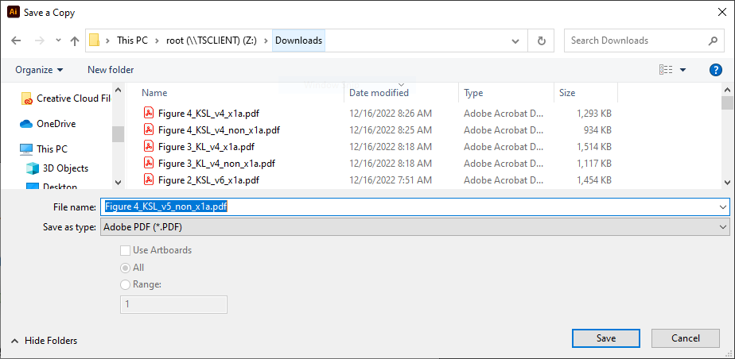
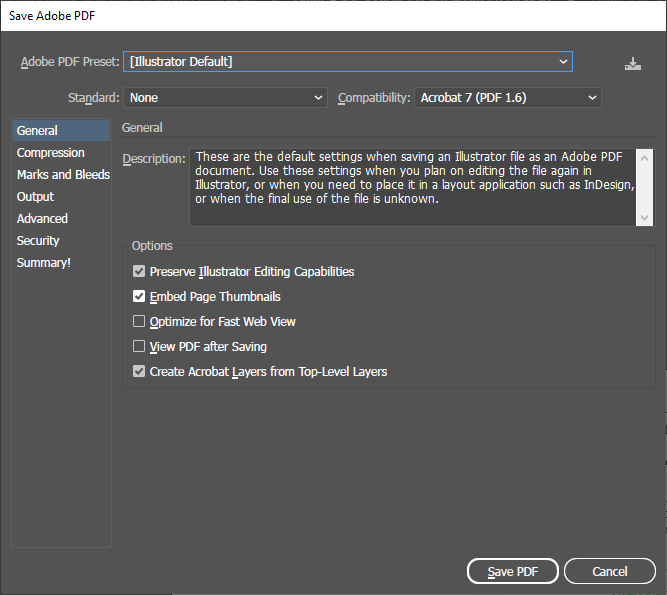
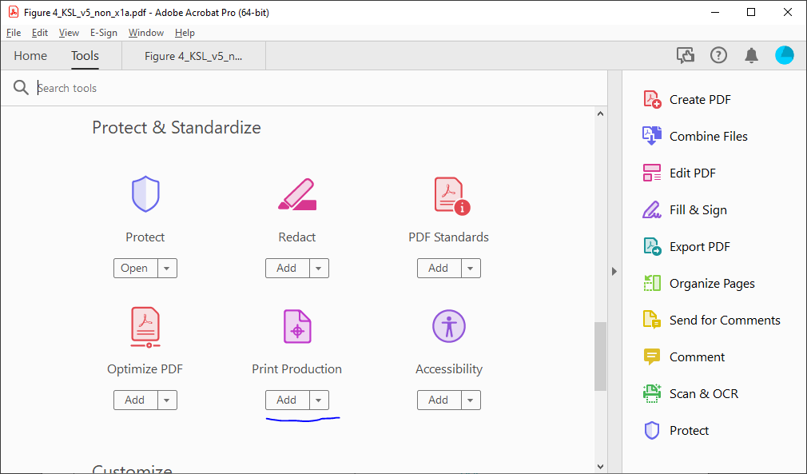
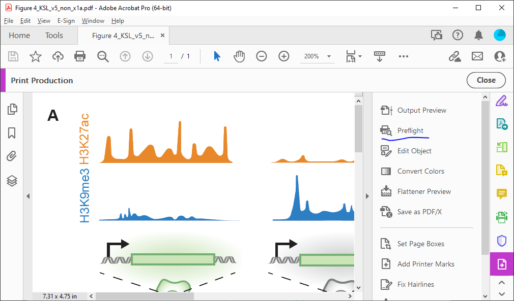
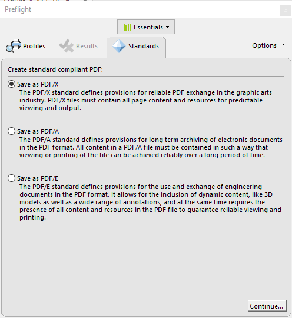
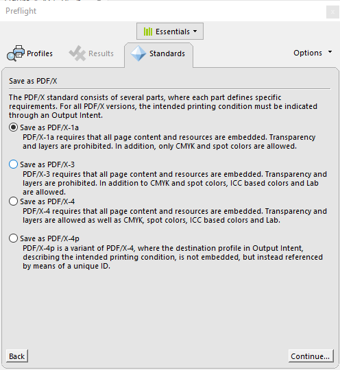
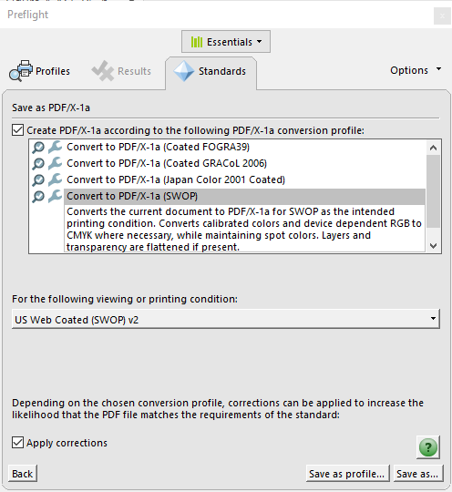
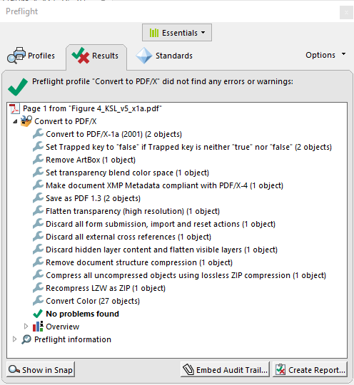

==============================
High-quality PDF figure export
==============================

a.k.a. how to not have journals munge your figures.

Intro
-----
Exporting high-quality, vector figures is a real challenge.
Despite PDF being a world standard, even programs like Illustrator
can struggle with exporting PDFs that render properly everywhere,
like in the printing pipeline that journals use.

Even when things render properly, you can run into color problems.
Converting your nice RGB
or CMYK colors to colors that render properly across computers and
also *print* in the expected color is an extremely challenging problem.
It is mostly solved nowadays with color profiles, but convincing all
of the various software to use standard profiles is hard.

Luckily, Adobe Acrobat includes a tool called **Preflight**
which will solve most of these issues.

The workflow for generating high-quality figures that stay high-quality
when postprocessed by journals is generally:

1. Make sure you aren't using key drawing features that introduce problems.
2. Assemble your final figure in software that can export standard PDFs.
3. Export as a **non-standards-compliant** PDF. This is the normal default.
4. Use Preflight inside Acrobat to export a **PDF X-1a** PDF using the **SWOP**
   color palette.

Problematic features
--------------------

Transparency/opacity
~~~~~~~~~~~~~~~~~~~~
While transparency/opacity works well if you are making a
figure that will just appear online, transparency causes many
problems when preparing files to print. Don't use it!

Transparency is not supported in the most standards-compliant PDF
version. This is because the final post-processing steps need to
properly assign colors, but there is not a good way to define
what opacity fundamentally is when you have to represent both
additive colors (e.g. your RGB monitor) and subtractive colors
(e.g. printed inks on paper) in the same file.

Because of this, regions overlapping partial transparent regions
will often get rasterized when sent to the journal.
Sadly, here's an example from the final published version of our first review:

Gradients/blurs
~~~~~~~~~~~~~~~
Blurs are often used to give some 3D feeling to objects. Gradients are fine,
but you should do these with the explicit gradient tools. Other Illustrator or Inkscape
methods to make color gradients, such as a Gaussian Blur tool or similar, are raster
operations and will cause your beautiful vector graphics to be rasterized.

Final figure export
-------------------

Illustrator
~~~~~~~~~~~
When exporting from Illustrator, hit "Save a Copy", and switch the output type to PDF.

When you get to the export screen, make sure you select `[Illustrator Default]` as the output type:

Illustrator *does* have an option to directly export a X-1a PDF, but it sucks at doing
so for some reason (it rasterizes things that should not be rasterized). Do not export in
a mode other than the Illustrator default.

Matplotlib/Python
~~~~~~~~~~~~~~~~~
Doing `plt.savefig` with a `.pdf` filename is sufficient.

Preflight
---------

1. Open up the exported figure in Adobe Acrobat. Sanity check your figure to make
   sure that there wasn't errant rasterization or other problems.

2. Under your tools tab, hit "More Tools" and
   hit "Add" below the Print Production option to add this set of tools to the access bar.

3. Click Print Production to bring up the tools, and hit "Preflight":

If this is the first time you have opened an advanced print production tool, Adobe may
have to download some extra data before the window comes up.

4. Click the "Standards" tab at the top. Select "Save as PDF/X" and hit continue.

5. Select the first option, "Save as PDF/X-1a" and hit continue.

6. Check the checkbox, and scroll down and select the "Convert to PDF/X-1a (SWOP)" profile.
   Hit "Save as.." and select a new filename (we suggest `fig_name_x1a.pdf` so you can tell
   which files have been converted).

.. note:: 

    SWOP originally was a US color profile. If publishing in international journals, carefully
    check the colors in your proofs. If they are off, you may want to resubmit using the
    FOGRA39 color profile (or see if you can ask someone which profile their production
    team uses).

    In general, this shouldn't be a problem, as production staff should be able to use
    whatever color profile, as long as it is standardized.

7. Watch Preflight convert. You should see a successful run. If you don't,
   you should have some error messages telling you what to fix. By far the most
   common source of conversion errors are transparency and deeply nested clipping groups.

   By clicking on an error, you can hit "Show" to see where the problematic element is.

8. Sanity check the converted X-1a PDF, for rasterization and other problems. Edit your
   source file to remove transprency or other problems and repeat these steps until you
   are happy with the X-1a version.
9. Submit the X-1a versions to the journal. A successful X-1a export practically guarantees
   that your figures will appear in the proofs as desired, with the correct colors.