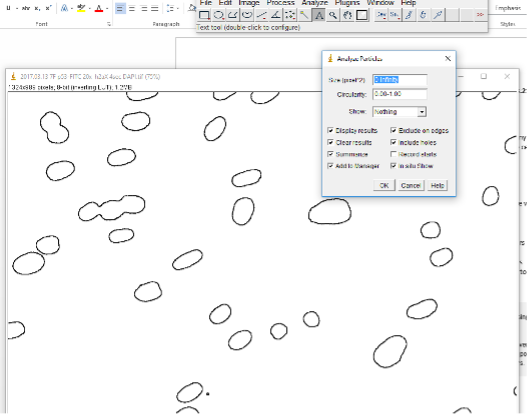
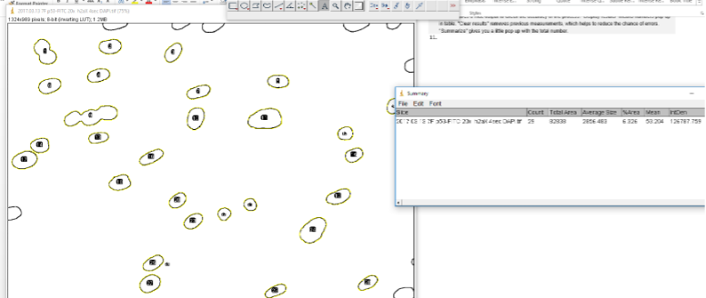
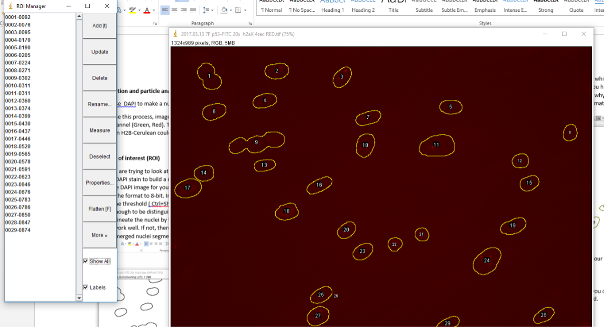
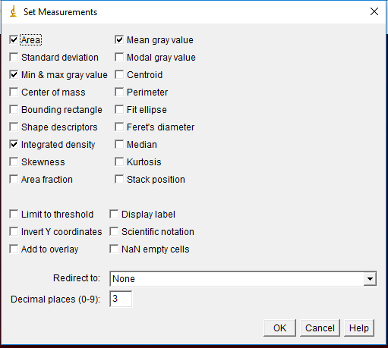
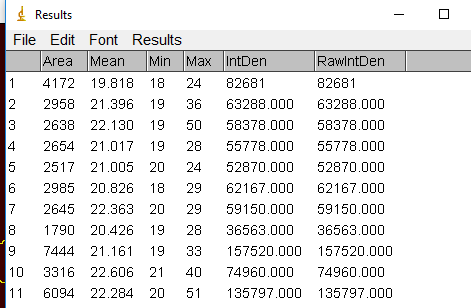
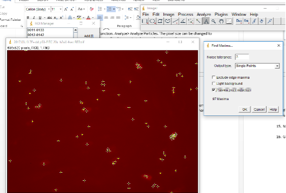
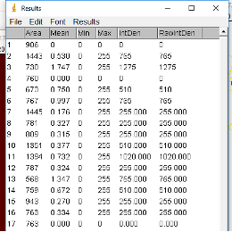

===================================================
Image segmentation and particle analysis in ImageJ
===================================================

.. warning::
  CellProfiler has become the preferred software for image segmentation and quantification. 

This protocol describes how to use DAPI images to make a nuclear mask and quantify nuclear staining intensity.

.. important::

  To use this process, images need to be collected from the same field with DAPI and any other desired channel (e.g., green, red). Thus, this protocol only works for fixed cells. Potentially, live cell imagining with an H2B-Cerulean could allow nuclear image analysis with this method. 

Defining regions of interest (ROI)
-----------------------------------

1. Since we are trying to look at the nucleus, the nucleus is our ROI. To define this region we will use the DAPI stain to build a mask. 
2. Open the DAPI image for your sample. 
3. Change the format to 8-bit. Image > Type > 8-bit. 
4. Adjust the threshold (``Ctrl-Shift-T`` or *Image* -> *Adjust* -> *Threshold*) until each nucleus appears bright enough to be distinguished from the background. 
5. Then delineate the nuclei by tracing: *Process* -> *Find Edges*. If nuclei are well separated, this should work well. If not, there is a program/plug-in called *Watershed* that can be used to resolve merged nuclei segments. 
6. Then use Analyze Particles function: *Analyze* -> *Analyze Particles*. The pixel size can be changed to exclude particles that are too small or big or not circle enough or too circular.

7.	The ROIs should now be labeled with numbers to indicate which is which. If you only want to count numbers of nuclei, the *Summary* window will tell you how many. In the case below, it counts 29. However, we can see that #9 is 3 nuclei. That’s why the *Watershed* program may be useful and necessary. Still this process gives us a good estimate for generally well separated nuclei. 

Now that we have our regions of interest, it is time to get our other images with our staining.

8.	Open the RED/GREEN or other image. 
9.	GO to *Analyze* -> *Tools* -> *ROI Manager*. In the ROI Manager, you can click on the different numbered ROIs to view them in the image you just opened. 

10.	If you would like to get the intensity for each ROI, then simply go to *Analyze* -> *Set Measurements*. Make sure *Area*, *Min & max gray value* and *Mean gray value*, and *Integrated density* are selected. Then click *OK*. 

11.	Next go to back to the ROI Manager and make sure all the desired regions are selected. You can deselect any that are problematic (too small, overlapping nuclei, etc). Then click on *Measure* and a window with the measurements will pop-up. 

12.	Save this as a tab delimited file to open in Excel later. The area will be useful for normalizing the intensity for size of the nucleus. 

Quantifying nuclear-localized foci
------------------------------------

13.	If instead of quantifying total intensity across the nucleus, you want to quantify foci in the nucleus, you will process the DAPI image as previous described. 
14.	Next open your stained image for foci counting. 
15.	Go to *Process* -> *Find Maxima*. Toggle with noise tolerance setting to get good detection of foci. The higher the noise tolerance the stronger the signal has to be to be detected. 

16.	Now go to ROI Manager and click on *Measure*. 
17.	The *RawIntDen* tells you how many foci in each ROI (e.g. it sums the 255 values (code for black dots) within each ROI). To determine the number of foci per region, simply divide by 255. Save this file in excel for further processing. 

Reference: http://microscopy.duke.edu/HOWTO/countfoci.html

Merging images in ImageJ
------------------------------------

1. Create a *Merged* folder inside the folder where your images are.
2. Open the files for the various channels (e.g., DAPI, red, green) you want to merge, then do *Image* -> *Color* -> *Merge*.
3. Make image any adjustments (e.g., brightness, contrast).
4. Save the new merged image as a ``.jpeg``.