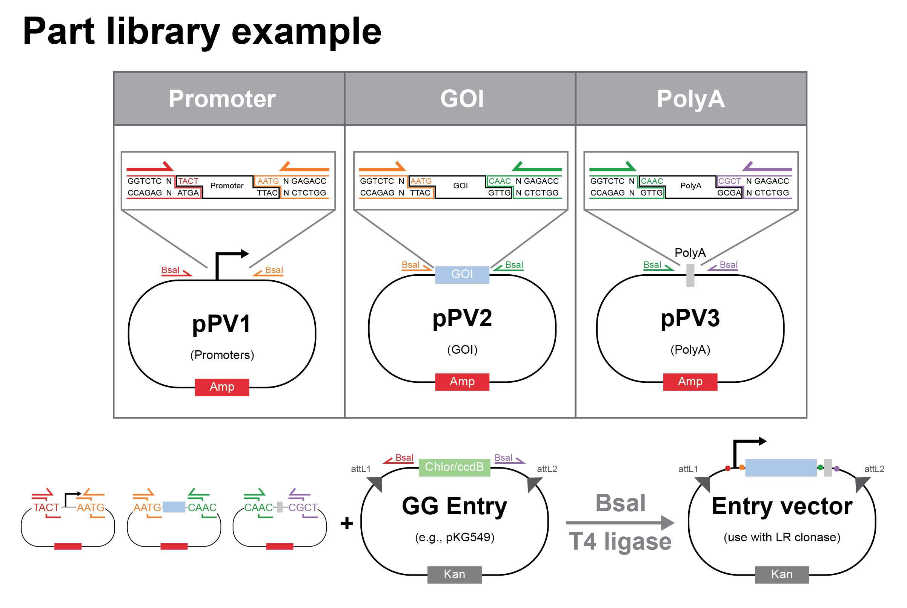
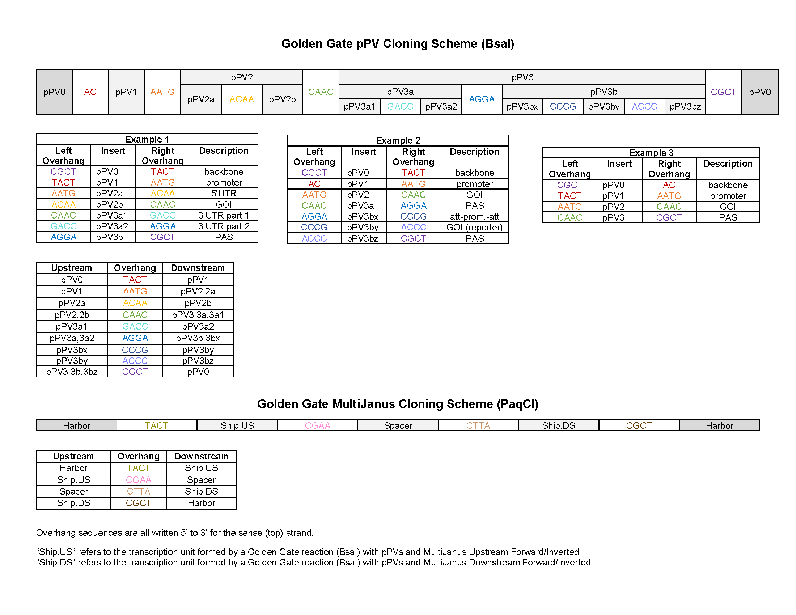
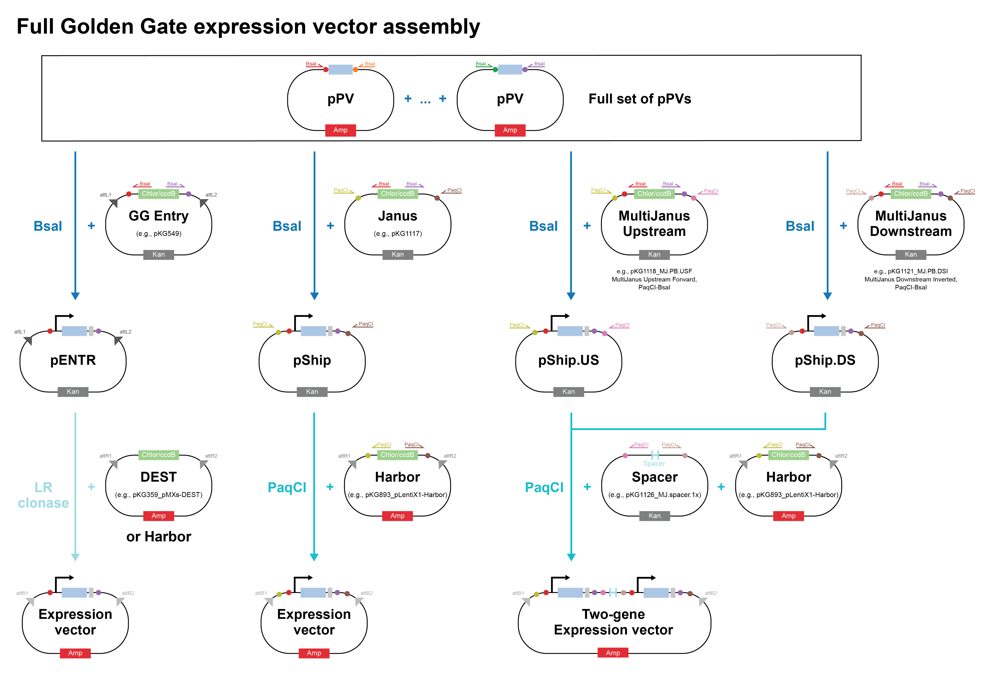

====================
Golden Gate assembly
====================

Golden Gate assembly allows us to create a construct using Type IIs restriction enzymes (REs).
These enzymes can generate custom connector sequences, enable scarless assembly, and enhance reaction efficiency through multiple rounds of digestion and ligation.

Protocol for PCR fragments
==========================
This protocol is derived from the standard NEB protocol (see :ref:`citations <citation>` below).

1. Design the assembly. Online tools such as `NEB Golden Gate <https://goldengate.neb.com/>`_ are available for designing primers, choosing connector sequences, etc.

2. Recipe for Golden Gate reaction (total volume = 10 µL):

================================= =================================================
  Component                          Amount
================================= =================================================
 75 ng/plasmid
 2:1 mol ratio for fragments
 10X T4 DNA ligase buffer          1 µL
 T4 DNA ligase (400 U/µL)          1.25 µL (500 U)
 Type II RE                        0.5 µL (increase to 1 µL if >10 inserts)
 H2O                               to 10 µL
================================= =================================================

.. note::
	Make sure to use 500 U T4 DNA ligase. NEB sells 400 and 2,000 U/µL T4 DNA ligase so scale volume accordingly.

3. Use the appropriate assembly protocol

================================= ========================================================================== ===============
  Insert number                      Assembly protocol                                                        Estimated time
================================= ========================================================================== ===============
 For 1 insert                      37°C, 5 min (cloning) or 37°C, 1 hr (library preparation) -> 60°C, 5 min   10 min - 1 hr
 For 2-10 inserts                  (37°C, 1 min -> 16°C, 1 min) x 30 -> 60°C, 5 min                           ~1.5 hrs
 For 11-20 inserts                 (37°C, 5 min -> 16°C, 5 min) x 30 -> 60°C, 5 min                           ~5.5 hrs
================================= ========================================================================== ===============

4. :doc:`Transform competent cells <transformation>` with 2 µL of the Golden Gate mixture.
5. Store unused Golden Gate assembly products at -20°C

Protocol for pPV plasmids
=========================
This protocol is specifically for Golden Gate assembly using the lab's positioning vector (pPV) cloning scheme and contains general best practices.

1. Design the assembly using the :ref:`pPV cloning scheme <pPV-scheme>` below.

.. note::
  It is okay to combine pPV plasmid fragments with PCR fragments in the same reaction. However, reactions with only plasmid fragments tend to be more efficient.

.. important::
  The Golden Gate reaction will still work if one of the fragments has an internal RE cut site, but it will be less efficient.
  Be sure that the connector sequence generated by the internal RE cut site does not match any of the pPV connector sequences!
  If you run into issues with assemblies of this type, try the maximum number of cycles (99x on the thermocycler) and run the reaction overnight. You can also try to DNA clean-up the golden gate reaction and ligate with T4 ligase overnight before transformation.

2. Recipe for Golden Gate reaction (total volume = 10 µL):

================================= =================================================
  Component                          Amount
================================= =================================================
 75 ng/plasmid
 10X T4 DNA ligase buffer          1 µL
 T4 DNA ligase (400 U/µL)          1.25 µL (500 U)
 Type II RE                        0.5 µL (increase to 1 µL if >10 inserts)
 H2O                               to 10 µL
================================= =================================================

.. note::
  Smaller 5 µL (instead of 10 µL) reactions also work, halving the volume of each component.
  This is best done with multiple, similar reactions by making a master mix containing the ligase buffer, ligase, RE, H20, and any common pPV fragments to avoid pipetting small volumes.
  However, be sure to use a 10 µL reaction for difficult assemblies (e.g., fragment contains an internal RE cut site).

3. Use the guidelines below to choose an appropriate assembly protocol. In general, longer assemblies (more cycles) are preferred, especially if reactions are run overnight.

============================================== ============================================================== =========================
  Insert                                        Assembly protocol                                              Estimated reaction time
============================================== ============================================================== =========================
 <5 plasmid fragments (fast)                    (37°C, 1 min -> 16°C, 1 min) x **30** -> 60°C, 5 min            ~1.5 hrs
 5+ plasmid fragments (fast)                    (37°C, 1 min -> 16°C, 1 min) x **60** -> 60°C, 5 min            ~3 hrs
 5+ plasmid fragments (long), 1 PCR fragment    (37°C, 1 min -> 16°C, 1 min) x **99** -> 60°C, 5 min            ~5 hrs
 |difficult-assembly|                           (37°C, 5 min -> 16°C, **5** min) x **99** -> 60°C, **5** min    ~18 hrs
============================================== ============================================================== =========================

  Reactions can be held at 4°C or 16°C overnight.

.. |difficult-assembly| replace:: >1 PCR fragments, fragments with internal RE cut site, other difficult assemblies

4. If a fragment contains an internal RE cut site, perform an extra ligation step to improve efficiency.

  1. Clean and concentrate the assembly reaction using the DNA Cleanup Kit. Elute in 8.5 µL H20.
  2. Add 1 µL 10X T4 DNA ligase buffer and 0.5 µL T4 DNA ligase (400 U/µL), according to the :doc:`ligation protocol <ligation_assembly>`.
  3. Let the reaction run at room temperature (or 16°C) at least 1 hr, preferably overnight.

5. :doc:`Transform competent cells <transformation>` with at least 2 µL of the Golden Gate mixture.
6. Store unused Golden Gate assembly products at -20°C

.. _pPV-scheme:

Reference for pPV connector sequences
==========================================

Reference for entire Golden Gate workflow
==========================================

.. _citation:

Citations
---------
[1] https://www.neb.com/protocols/2018/06/05/golden-gate-24-fragment-assembly-protocol

[2] https://www.neb.com/-/media/nebus/files/manuals/manuale1601.pdf

