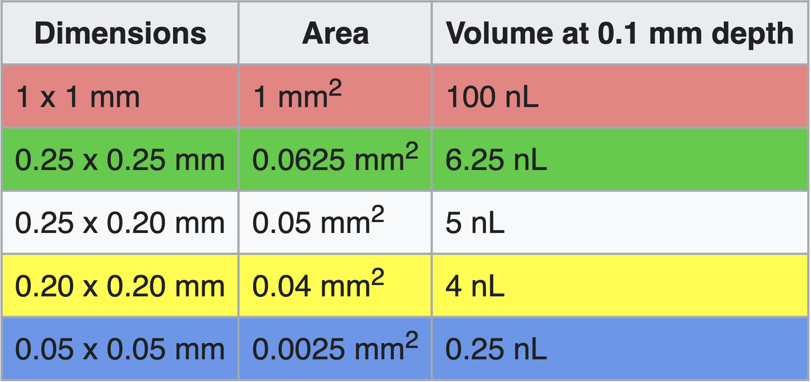
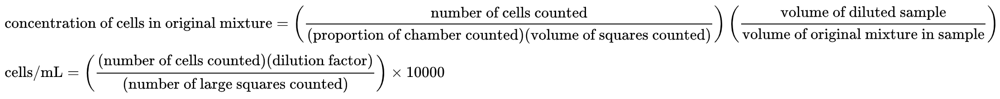

======================
Adherent Cell Culture
======================

General culture handling procedure
-----------------------------------

- Lift lid and tilt plate with one hand while aspirating/pipetting with the other.
- The lid should cover the plate as much as possible, providing just enough opening to perform the task
- The lid opening should face away from the hood opening (i.e., away from you and toward the back wall).
- Tilt the plate toward the back when aspirating.
- When aspirating, immerse the pipet tip in the media but don't touch the plate bottom until the very end to avoid aspirating away cells.
- Tilt media gently against the side wall of the dish to avoid dislodging cells.

Changing media
---------------

Unless you have very specific experimental conditions, it is good practice to check on your cultures
every 2 or 3 days and change media if the cells are not ready to be split or expanded.

Recommended media volumes are listed below.

============================   ============================
**Culture dish/plate/flask**    **Approx. volume media**
============================   ============================
10-cm                           10 mL
15-cm                           15 mL
6-well                          2 mL (1-3 mL)
12-well                         1 mL (1-2 mL)
24-well                         500 µL (500-1,000 µL)
48-well                         250 µL (200-400 µL)
96-well                         100 µL (100-200 µL)
T-75                            10 mL (8-15 mL)
T-182                           25 mL (20-25 mL)
============================   ============================

Source: `General culture volumes <https://www.thermofisher.com/us/en/home/references/gibco-cell-culture-basics/cell-culture-protocols/cell-culture-useful-numbers.html>`_

.. _passaging:

Passaging cells
----------------
Passage number is an “indicator” of cell age. Every time the cells are detached from one dish and passaged into another dish, giving them room to divide/expand, the passage number increases by 1.

1.  Aspirate away old media.
2.  Wash with PBS (*optional*)

    i.  Gently add PBS to the side of the dish/plate, not directly on the cells
    ii. Aspirate away PBS

.. note::
    Washing with PBS may make it easier to detach cells during trypsin step

.. note::
    Some types of cells do not require trypsin to detach (e.g. HEK293Ts, Plat-Es). In that case, just pipette up and down until cells detach. This looks like a thin film disappearing from the bottom of the dish/plate/flask.

3.  Add 0.05% trypsin to detach cells from the plate.

    .. note::
        We buy 0.25% trypsin, so dilute it to the appropriate concentration in PBS. DO NOT DILUTE WITH ANYTHING WITH FBS!
        Using a higher concentration of trypsin will make the cells dislodge faster/easier, but can be more toxic.
    ..

    Trypsin should cover the entire surface area; this is typically half the media volume:

    =================================   =================================
    **Culture dish/plate/flask**        **Approx. volume 0.05% Trypsin**
    =================================   =================================
    10-cm                                   1 mL
    15-cm                                   3 mL
    6-well                                  500 µL/well
    12-well                                 300 µL/well
    24-well                                 150 µL/well
    96-well                                 50 µL/well
    T-75                                    5 mL
    T-182                                   15 mL
    =================================   =================================

4.  Incubate at room temperature or in 37°C incubator for 3-4 min, checking cells to avoid over-digestion.

    - Detached cells look rounded and refractile under the microscope, and by eye the media might look cloudy as it fills with cells.
    - Different types of cells will require different incubation periods.
    - The stronger the trypsin (higher %) the faster cells will detach.
    - To help physically detach the cells from the plate, pipet trypsin along the sides to "wash" the cells or tap the side of the flask.

5. Neutralize with at least 2 volumes of media that contains FBS (e.g. neutralize 1 mL 0.05% trypsin with at least 2 mL FBS-containing media).
6. Mix well by pipetting and make sure that all cells are detached. Transfer to a 15 mL or 50 mL conical.
7. Centrifuge at 400g for 4 minutes. Cells should pellet at the bottom of the conical.
8. Aspirate all media/trypsin, carefully avoiding aspirating the cell pellet.
9. Resuspend pellet in 1-10 mL of media (volume is your choice).
10.  If needed, :ref:`count the cells <counting>` to determine the proper dilution for passaging.
11.  Seed new dish/flask with desired number or dilution of cells: mix the appropriate volume of resuspended cells with fresh media and add to a new flask/dish.

    .. tip::
        Make sure the cells are resuspended well before aliquoting to seed the new dish. Cells tend to settle quickly!
    ..

    - General dilution guidelines will vary by cell type, but typical numbers for confluent HEK293T cells (doubling time ~24 hrs) are as follows:

    ========= ================
    Dilution  Confluent at day
    ========= ================
    1:2        1 (next day)
    1:4        2
    1:8        3
    ========= ================

    - For instance, cells from a T75 flask resuspended in 1 mL of media can be passaged 1:4 by adding 250 µL cells and 10 mL media to a new T75 flask.
    - Passaging will generate several new flasks/dishes of cells; if only one flask/dish is desired, the extra cells can be :doc:`cryopreserved <cryopreservation_and_thawing>`.

12. Cultures should be labeled with cell line name, date, passage number and initials of the owner.

    - Certain cell lines should also include the passage number of antibiotic selection, e.g. "Plat-E, Blast/Puro @ P12"

    .. note::
        Don't forget to increase the passage number by 1 on the new flask/dish!

.. _counting:

Counting cells
--------------

1. Start with cells in suspension, i.e. dissociated from culture flask/dish and resuspended in a low volume (1-5 mL) of fresh media (see :ref:`Passaging cells <passaging>` steps 1-9).
2. Dilute the cells as needed, based on a rough estimate of cell count.

   For instance, a typical dilution for a T75 flask of confluent HEK293T cells: resuspend in 2 mL media, then further dilute 1:10 by adding 10 µL cells to 90 µL media.

3. Prepare the hemocytometer by placing the glass coverslip on top of the chamber.
4. Pipet 10 µL diluted cells into the notch on the chamber, such that the liquid is held between the metal and the coverslip.
5. Under the microscope, count the number of cells in one of the marked regions on the hemocytometer, and calculate the cell concentration according to the volume of that region:

.. image:: img/hemocytometer-grid.png

Image source: `<https://en.wikipedia.org/wiki/Hemocytometer>`__

    For instance, for cells diluted 1:10, several regions the size of the red region above could be counted and averaged, then this number would be multiplied by 1e5 to obtain the concentration in cells/mL of the original suspension.

    **Avg # cells counted** / 100 nL * 1e9 nL / 1e3 mL * 10x dilution = **Avg # cells counted** * 1e5 /mL

.. note::
    Counting more cells---by diluting the cell sample less, counting a larger region of the hemocytometer, or averaging the counts of several regions of the same size---will increase the accuracy of the concentration calculation.

.. _seed-plating-cells:

Seeding/Plating cells
--------------------------------------------------------

.. note::
    If applicable, :ref:`gelatin coat <gelatin>` new plates before beginning so the gelatin has time to sit.
    Plates should be gelatin-coated for culturing MEF cells and for protocols such as virus production.

1. Start with cells suspended in a low volume (e.g. 1-5 mL) of fresh media (see :ref:`Passaging cells <passaging>` steps 1-9).
2. :ref:`Count the cells <counting>`.
3. Mix cells with the appropriate volume of fresh media according to your experimental guidelines. The media volume should be the total media volume for all wells/dishes.

   Generally, for 80-90% confluent cells the next day:

   =============== =============== ===============
   **Cell Type**    **Well Size**     **# Cells**
   =============== =============== ===============
   MEF             6-well              100-160K
   MEF             96-well             5-10K
   HEK293T         10cm                750K
   HEK293T         96-well             20-40K
   Plat-E          6-well              800K
   =============== =============== ===============

   For example, to seed a full 96-well plate of MEFs at 10k (1e4) cells/well: mix 1e6 cells (1e4 cells/well * 100 wells) with fresh media to a total volume of 10 mL (100 µL/well * 100 wells).

4. Pipet cells into new flask/dish or wells of the new plate. This should account for the entire flask/dish/well volume (e.g. 10 mL into a T75 flask, 100 µL into each well of a 96-well plate).
5. Any excess cells can be :ref:`passaged <passaging>` to a new flask or :doc:`cryopreserved <cryopreservation_and_thawing>`.

Laminin Coating
---------------------------------------------------------

Materials

- 100x Laminin (1 mg/mL; stored -20 deg C)
- PBS

Protocol

1. Add laminin to PBS.
2. Add 2 mL laminin-PBS to each 6 well plate.
3. Allow wells to set for 2-4 hours before removing excess liquid and plating cells.

.. _gelatin:

Gelatin Coating
---------------------------------------------------------

Materials

- 0.1% Gelatin (sterile)

Protocol

1. Add enough gelatin to coat the bottom of the flask or well (approximately half of the media volume needed for the well).
2. Let sit for 10 min at room temperature.
3. Aspirate excess gelatin. Use for plating cells within 1-2 hrs maximum, otherwise gelatin may dry out.

.. _culturing_T-Rex_Cells:

Maintaining Integrated Cell Lines made with a selection marker in culture 
-------------------------------------------------------------------------

To increase the stability of integrated cell lines (ie., Plat-Es, T-Rex 293 line, PiggyBac/CRISPR-edited lines), it is imperative to adhere to TC best practices, routinely passaging cell lines every 2-3 days. 
It is advisable to culture cells in a reduced (but non-zero) concentration of antibiotic used for the original selection `see Mirus guidelines on cell line creation <https://www.mirusbio.com/applications-stable-cell-line-generation/>_`.

For CRISPR/PiggyBac cell lines integrated with Puromycin, culturing the cells in 0.5 ug/mL Puromycin every 3 passages should increase the retention of the transgene on the genome and perhaps attenuate transgene silencing.

For maintenance of Plat-Es (Deon doesn't know what the lab typically does for Plat-Es)

For maintenance of the T-REx™ Cell Line, Thermo recommends culturing the cells in 100ug/mL zeocin (1:1000 dilution master stock) and 5ug/mL blasticidin (1:2000 dilution master stock). The T-REx Line stably expresses the tetracycline repressor protein. They save significant time and effort when using the T-REx™ System. The T-REx™ Cell Lines are functionally tested by transient transfection with the positive control vector pcDNA™4⁄TO⁄lacZ. T-REx™ Cell Lines exhibit extremely low basal expression levels in the repressed state and high expression upon induction with tetracycline (or doxycycline).
For documentation of general (not Flp-in version) see `here <https://www.thermofisher.com/order/catalog/product/R71007#:~:text=T%2DREx%E2%84%A2%20Cell%20Lines,4%E2%81%84TO%E2%81%84lacZ>`.
For documentation of the Flp-in system see `here <https://www.thermofisher.com/document-connect/document-connect.html?url=https://assets.thermofisher.com/TFS-Assets%2FLSG%2Fmanuals%2Fflpinsystem_man.pdf>`.

