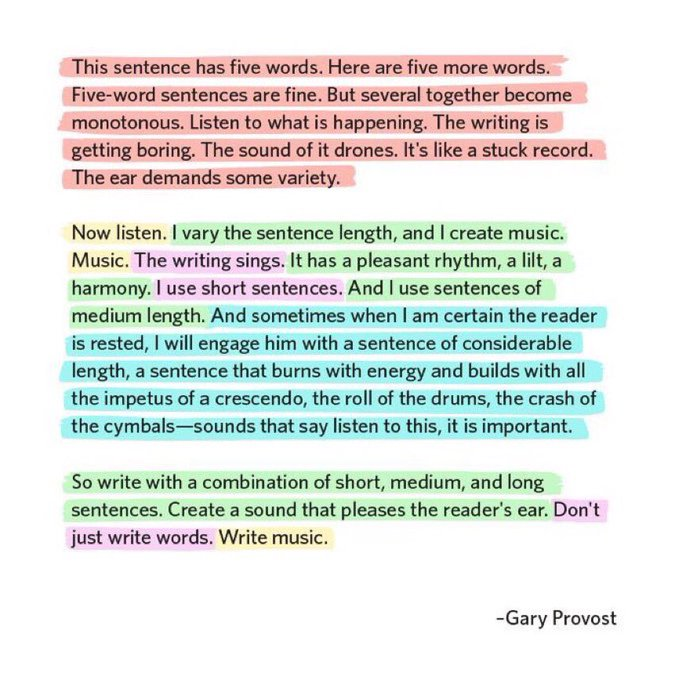

Guiding principles
===================

1. Outline each section first. See below.  
   
2.  If you are writing a paper, the claims structure the outline. Outlines accelerate our ability to identify deficits in logical clarity are best. The experiments are the evidence that support the claims. 	
   
3. Consistency is key. Style choices must be made but the same ones should be made throughout a single document and ideally throughout a single lab. 	Clarity trumps style. 

4. When in doubt, turn it into two simpler sentences. See editing/revising. 
   
5.	Find examples of writing that you like for the type of manuscript that you are writing and work from those. You can reverse engineer good writing.

Tips
-----

Outline
-------------------------------
Always, always, always outline your work first. If the logical flow sucks, the words do not matter. The structure must be solid. Do not waste your time getting a flimsy structure dressed up with fancy words, syntax, etc. Get the structure correct and then polish a strong framing.

Active Voice
-------------------------------
Write in active voice as much as possible! Your writing will be more comprehensible and often more compact. 
You can delete every instance of "has been shown to" to switch to active voice. 

**For example:**

* **Passive**: This writing tip has been shown to work. 

* **Active**: This writing tip works.

Editing and revising
-------------------------------
When you start, the main goal should be to just make coherent thoughts. Through the process of revising, you can later reshape those coherent thoughts into beautiful writing which is more akin to "music." 
 

